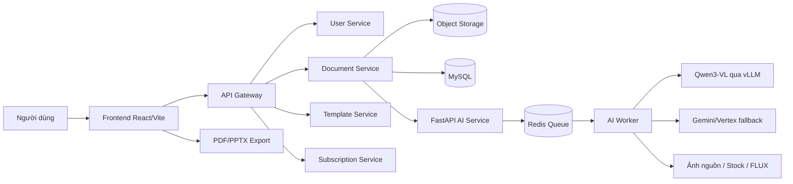

# TÓM TẮT NỘI DUNG PHỤC VỤ BÁO CÁO THỰC TẬP

## Đề tài

**Xây dựng và triển khai hệ thống sinh slide ứng dụng trí tuệ nhân tạo**

## Lưu ý về phạm vi và nguồn thông tin

Tài liệu này được tổng hợp từ source code và tài liệu kỹ thuật hiện có của dự án LecGen. Phạm vi chỉ bao gồm hệ thống tạo, quản lý, chỉnh sửa, trình chiếu và xuất bài giảng/bài thuyết trình bằng AI.

Các nội dung được ghi là "xác định từ source" có căn cứ trong mã nguồn hoặc tài liệu đi kèm dự án. Những thông tin về đơn vị thực tập, thời gian thực hiện, phân công cá nhân, cấu hình hạ tầng thực tế và số liệu đánh giá cần người thực hiện xác nhận riêng. Tài liệu không sử dụng nội dung từ file cấu hình môi trường hoặc thông tin bí mật.

---

## 1. Bài toán, mục tiêu và phạm vi hệ thống

### 1.1. Bài toán

Việc xây dựng một bài trình chiếu hoàn chỉnh thường yêu cầu người dùng đọc tài liệu, xác định ý chính, chia nội dung thành từng slide, viết tiêu đề và gạch đầu dòng, tìm hình ảnh minh họa, xây dựng bảng hoặc biểu đồ, lựa chọn mẫu trình bày và chỉnh sửa bố cục. Quy trình này tốn thời gian, đặc biệt đối với bài giảng hoặc tài liệu dài.

Hệ thống LecGen giải quyết bài toán trên bằng cách tiếp nhận yêu cầu ngôn ngữ tự nhiên hoặc tài liệu nguồn, sử dụng mô hình ngôn ngữ để xây dựng nội dung có cấu trúc, bổ sung thành phần trực quan phù hợp và trả về một bộ slide có thể tiếp tục chỉnh sửa trên giao diện web.

### 1.2. Mục tiêu

- Rút ngắn thời gian tạo bài giảng và bài thuyết trình.
- Cho phép tạo slide từ prompt hoặc tài liệu PDF/DOCX.
- Tự động tổ chức nội dung thành tiêu đề, gạch đầu dòng và ghi chú thuyết trình.
- Tự nhận diện trường hợp phù hợp với văn bản, hình ảnh, bảng hoặc biểu đồ.
- Cho phép người dùng chỉnh sửa thủ công hoặc yêu cầu AI sửa bằng ngôn ngữ tự nhiên.
- Hỗ trợ quản lý dự án, trình chiếu và xuất thành PDF/PPTX.
- Tách riêng tác vụ AI chạy lâu khỏi API nghiệp vụ để hệ thống dễ mở rộng và theo dõi tiến độ.

### 1.3. Phạm vi

Phạm vi chức năng được xác định từ source gồm:

- Xác thực người dùng và quản lý tài khoản ở mức cần thiết để sử dụng hệ thống.
- Quản lý dự án slide và tài liệu nguồn.
- Tạo slide từ prompt, file mới tải lên hoặc tài liệu đã lưu.
- Sinh và lưu deck dưới dạng dữ liệu JSON có cấu trúc.
- Render, chỉnh sửa, lưu, trình chiếu và xuất slide trên frontend.
- Quản lý mẫu trình bày, gói sử dụng và hạn mức tạo/sửa slide.
- Theo dõi trạng thái và tiến độ tác vụ AI.

Phạm vi không bao gồm việc xây dựng một phần mềm trình chiếu đầy đủ như Microsoft PowerPoint hoặc Canva. Một số thành phần trang trí phức tạp của template chưa phải là các đối tượng canvas độc lập và khả năng chỉnh sửa file PPTX có giới hạn nhất định.

**Căn cứ chính:** `README.md`, `README_FE_API.md`, `fe_api_spec.md`, `front-end/README.md`.

---

## 2. Các công việc chính đã thực hiện

Các nhóm công việc có thể trình bày trong báo cáo gồm:

1. Khảo sát bài toán sinh slide và thiết kế dữ liệu slide có cấu trúc.
2. Xây dựng giao diện web cho tạo, quản lý, xem và chỉnh sửa slide.
3. Xây dựng các dịch vụ backend quản lý tài khoản, dự án, tài liệu, template và hạn mức sử dụng.
4. Xây dựng AI Service nhận prompt/tài liệu và tạo deck JSON.
5. Xây dựng quy trình trích xuất nội dung PDF, DOCX và TXT ở phía AI Service; giao diện chính hiện công khai lựa chọn PDF/DOCX.
6. Xây dựng cơ chế truy hồi nội dung tài liệu dài theo trang bằng BM25 kết hợp embedding khi khả dụng.
7. Xây dựng pipeline lập kế hoạch, sinh nội dung, tinh chỉnh, kiểm tra chất lượng và chuẩn hóa slide.
8. Xây dựng cơ chế sinh/thu thập và đánh giá ảnh minh họa; hỗ trợ ảnh từ tài liệu nguồn, ảnh stock và mô hình sinh ảnh.
9. Xây dựng dữ liệu bảng, biểu đồ và speaker notes theo cấu trúc riêng.
10. Xây dựng luồng sửa slide bằng prompt tự nhiên, bao gồm sửa một/nhiều slide, thêm, xóa hoặc tái cấu trúc deck.
11. Xây dựng editor, autosave, undo/redo, trình chiếu và xuất PDF/PPTX.
12. Đóng gói các thành phần bằng Docker và tổ chức chạy bằng Docker Compose.
13. Kiểm thử các thành phần AI như giới hạn gói, truy hồi nguồn, bảng/biểu đồ, ảnh, chế độ bài giảng, fallback mô hình và sửa slide.

**Căn cứ chính:** `ai-service/tests/`, `ai-service/backend/services/`, `front-end/src/`, `back-end/document-service/`.

---

## 3. Các chức năng sinh slide đã hoàn thành

### 3.1. Tạo nội dung

- Tạo bài trình chiếu từ prompt tiếng Việt hoặc tiếng Anh.
- Tạo bài trình chiếu từ PDF/DOCX kết hợp yêu cầu của người dùng.
- Dùng lại tài liệu đã tải lên thay vì bắt buộc tải lại.
- Tự xác định số slide theo yêu cầu và giới hạn gói sử dụng.
- Phân loại mục đích thành bài giảng hoặc bài thuyết trình dựa trên ngữ nghĩa của yêu cầu và tài liệu.
- Tạo tiêu đề deck, tiêu đề từng slide, gạch đầu dòng và speaker notes.
- Với chế độ bài giảng, hỗ trợ mục tiêu học tập, ví dụ, phần luyện tập và tổng kết theo khả năng của pipeline.
- Giữ thông tin trang nguồn trong một số slide để hỗ trợ truy vết nội dung.

### 3.2. Nội dung trực quan

- Tự lựa chọn layout văn bản, văn bản kèm ảnh, bảng hoặc biểu đồ.
- Sinh bảng có `headers` và `rows` khi dữ liệu phù hợp.
- Sinh biểu đồ dạng cấu trúc với nhãn, giá trị, chuỗi dữ liệu và loại biểu đồ.
- Trích xuất ảnh raster và một số hình/vector từ PDF nguồn.
- Ghép ảnh trong tài liệu với slide dựa trên trang nguồn và nội dung.
- Tìm ảnh stock hoặc gọi máy chủ sinh ảnh FLUX khi phù hợp.
- Kiểm tra ảnh bằng các bước xác thực file, độ liên quan CLIP và VLM khi dịch vụ tương ứng khả dụng.
- Không dùng ảnh đồng thời với bảng/biểu đồ trong cùng tuyến visual khi có nguy cơ làm slide quá chật.

### 3.3. Chỉnh sửa và sử dụng kết quả

- Hiển thị danh sách slide, slide chính và bảng công cụ trong editor.
- Chỉnh nội dung text, font, cỡ chữ, màu, kiểu danh sách, căn lề và khoảng cách dòng.
- Chỉnh sửa bảng, biểu đồ và ảnh trong phạm vi editor hiện có.
- Thêm/xóa slide và đồng bộ thứ tự/nội dung về backend.
- Autosave thay đổi; hỗ trợ undo/redo trong phiên chỉnh sửa.
- Chọn template và lưu template cho project.
- Trình chiếu toàn màn hình.
- Xuất PDF theo hình ảnh render trên web.
- Xuất PPTX dạng hình ảnh hoặc PPTX editable bằng các đối tượng PowerPoint mà hệ thống ánh xạ được.
- Ghi speaker notes vào PPTX editable.

### 3.4. Sửa bằng AI

- Nhận yêu cầu sửa bằng một ô prompt tự nhiên.
- AI tự xác định phạm vi sửa; slide đang mở chỉ được dùng làm ngữ cảnh nếu prompt không chỉ định rõ.
- Hỗ trợ sửa tiêu đề, nội dung, notes, ảnh, bảng, biểu đồ và layout.
- Hỗ trợ thêm slide, xóa slide, sửa nhiều slide hoặc toàn bộ deck.
- Giữ nguyên slide ngoài phạm vi sửa theo `slide_id` khi có thể.
- Sau khi sửa, frontend tải lại toàn bộ pages để bảo đảm dữ liệu đồng bộ.
- Nếu tác vụ sửa thất bại, backend giữ lại task thành công gần nhất để deck cũ vẫn tiếp tục sử dụng được.

**Căn cứ chính:** `ai-service/backend/services/content/slide_pipeline.py`, `ai-service/backend/services/revision_rules.py`, `ai-service/backend/services/images/pipeline.py`, `front-end/src/pages/EditorPage/EditorPage.jsx`, `front-end/src/components/slides/`, `front-end/src/services/editablePptxExportService.js`.

---

## 4. Công nghệ chính được sử dụng

### 4.1. Frontend

- React 19 và React DOM.
- Vite để phát triển và build frontend.
- React Router cho điều hướng.
- Zustand cho quản lý trạng thái.
- Axios cho giao tiếp API.
- Lucide React cho biểu tượng giao diện.
- Recharts cho hiển thị biểu đồ.
- html2canvas và jsPDF cho xuất PDF theo hình ảnh render.
- PptxGenJS cho xuất PPTX editable.
- Framer Motion cho một số hiệu ứng giao diện.

**Căn cứ:** `front-end/package.json`.

### 4.2. Backend nghiệp vụ

- Java 21.
- Spring Boot 3.x.
- Spring Cloud Gateway làm cổng API.
- Spring Security và OAuth2 Resource Server để xác thực/ủy quyền.
- Spring Data JPA để truy cập cơ sở dữ liệu.
- Spring Cloud OpenFeign và REST client cho giao tiếp nội bộ.
- Redis cho cache/trạng thái hỗ trợ.
- RabbitMQ cho giao tiếp sự kiện ở một số dịch vụ.
- AWS SDK S3 để làm việc với object storage tương thích S3.
- Maven để quản lý và build các dịch vụ Java.

**Căn cứ:** các file `pom.xml` trong `back-end/`, đặc biệt `back-end/document-service/pom.xml` và `back-end/api-gateway/pom.xml`.

### 4.3. AI Service

- Python và FastAPI để xây dựng API AI.
- Uvicorn để chạy ứng dụng ASGI.
- Redis để quản lý hàng đợi tác vụ; API và worker được tách riêng.
- PyMuPDF, pdfplumber và PyPDF2 để xử lý PDF.
- python-docx để xử lý DOCX.
- FastEmbed để tạo embedding phục vụ truy hồi ngữ nghĩa.
- HTTPX/Requests để gọi mô hình và dịch vụ ảnh.
- Qwen3-VL-8B chạy qua vLLM là mô hình chính theo tài liệu hiện tại.
- Gemini/Vertex AI đóng vai trò fallback hoặc lớp review khi được cấu hình.
- FLUX là mô hình sinh ảnh được gọi qua một image server riêng.
- Pexels/ảnh stock là một nguồn ảnh dự phòng khi được cấu hình.
- Pillow để xử lý và kiểm tra ảnh.
- python-pptx có trong AI Service và hỗ trợ tuyến tạo PPTX phía Python; luồng web hiện tại chủ yếu xuất file từ frontend.

**Căn cứ:** `ai-service/requirements.txt`, `ai-service/README.md`, `ai-service/backend/services/content/llm_client.py`, `ai-service/backend/services/images/pipeline.py`.

### 4.4. Hạ tầng dữ liệu và đóng gói

- MySQL cho Document Service và Template Service.
- PostgreSQL cho User Service, Subscription Service và các miền liên quan theo cấu trúc Compose hiện có.
- Redis cho cache và hàng đợi AI.
- RabbitMQ cho message queue giữa các dịch vụ nghiệp vụ.
- S3 hoặc hệ lưu trữ tương thích S3 để lưu tài liệu/media.
- Docker và Docker Compose để đóng gói, tạo network và volume cho hệ thống.

**Căn cứ:** `docker-compose.yml`, `ai-service/docker-compose.yml`, `docker/mysql/init/`, `docker/postgres/init/`.

---

## 5. Kiến trúc tổng quan và vai trò các thành phần

### 5.1. Sơ đồ tổng quát

### 5.2. Frontend

Frontend là lớp tương tác trực tiếp với người dùng. Thành phần này thực hiện:

- Đăng nhập và quản lý phiên người dùng.
- Hiển thị dashboard và danh sách project.
- Nhận prompt, template và tài liệu nguồn.
- Gửi yêu cầu tạo/sửa slide qua API Gateway.
- Theo dõi tiến độ tác vụ.
- Chuyển dữ liệu slide từ backend thành giao diện trực quan.
- Cung cấp editor, autosave, undo/redo, trình chiếu và export.

Frontend không gọi trực tiếp AI Service và không tự suy luận bảng/biểu đồ từ bullet; nó sử dụng các trường dữ liệu có cấu trúc mà backend cung cấp.

**Căn cứ:** `front-end/src/pages/GeneratePage/GeneratePage.jsx`, `front-end/src/pages/EditorPage/EditorPage.jsx`, `front-end/src/services/documentService.js`, `front-end/src/components/slides/`.

### 5.3. API Gateway và các backend service

API Gateway là điểm vào chung, định tuyến request đến các microservice và áp dụng cơ chế xác thực/rate limit/circuit breaker theo cấu hình của gateway.

Trong phạm vi sinh slide, Document Service là thành phần trung tâm:

- Quản lý project, tài liệu nguồn, slide pages và lịch sử task AI.
- Kiểm tra quyền sở hữu và hạn mức qua Subscription Service.
- Gửi tác vụ tạo hoặc sửa slide tới AI Service.
- Theo dõi trạng thái tác vụ và lưu deck hoàn thành vào cơ sở dữ liệu.
- Cung cấp API để frontend lấy pages và đồng bộ chỉnh sửa.

User Service phụ trách tài khoản và xác thực; Template Service phụ trách metadata template; Subscription Service phụ trách gói và hạn mức. Các dịch vụ Payment, Notification và Statistic tồn tại trong hệ thống tổng thể nhưng chỉ là thành phần hỗ trợ, không trực tiếp sinh nội dung slide.

**Căn cứ:** `back-end/api-gateway/`, `back-end/document-service/`, `back-end/user-service/`, `back-end/template-service/`, `back-end/subscription-service/`.

### 5.4. AI Service

AI Service gồm hai tiến trình chính:

- **FastAPI API:** tiếp nhận yêu cầu, kiểm tra đầu vào, tạo task và trả task ID.
- **Worker:** lấy task từ Redis, chạy pipeline AI và cập nhật tiến độ/kết quả.

Pipeline AI thực hiện các nhiệm vụ chính:

1. Đọc và làm sạch nội dung đầu vào.
2. Xác định ngôn ngữ, chế độ bài giảng/bài thuyết trình và phạm vi yêu cầu.
3. Truy hồi các trang liên quan nếu tài liệu dài.
4. Lập kế hoạch deck và phân chia nội dung.
5. Sinh tiêu đề, bullet, notes và layout.
6. Chuẩn hóa số slide, mật độ nội dung và tính nhất quán.
7. Tạo/kiểm tra bảng, biểu đồ và ảnh.
8. Review chất lượng và trả deck JSON.

**Căn cứ:** `ai-service/backend/main.py`, `ai-service/backend/worker.py`, `ai-service/backend/routes/api.py`, `ai-service/backend/services/content/`, `ai-service/backend/services/deck_planner.py`, `ai-service/backend/services/deck_coherence.py`.

### 5.5. Cơ sở dữ liệu và lưu trữ

Document Service lưu các nhóm dữ liệu quan trọng:

- `source_documents`: metadata tài liệu nguồn.
- `projects`: thông tin dự án, prompt, template, trạng thái và task AI hiện tại.
- `slide_pages`: nội dung từng slide, gồm text, notes, table, chart, image, layout, rich text và elements.
- `ai_task_logs`: lịch sử và trạng thái tác vụ AI.
- `project_exports`: metadata file đã xuất nếu sử dụng tuyến lưu export phía backend.

Tài liệu/media được thiết kế để lưu trên object storage tương thích S3; dữ liệu nghiệp vụ được lưu trong cơ sở dữ liệu quan hệ.

**Căn cứ:** `back-end/document-service/src/main/java/com/backend/documentservice/entity/`, `back-end/document-service/README.md`.

---

## 6. Luồng hoạt động của hệ thống

### 6.1. Tạo slide từ prompt

1. Người dùng đăng nhập và mở trang tạo slide.
2. Người dùng nhập chủ đề/yêu cầu và chọn template.
3. Frontend đánh giá sơ bộ độ rõ của prompt; prompt quá chung chung có thể bị chặn trước khi gửi.
4. Frontend gửi yêu cầu tạo project tới Document Service qua API Gateway.
5. Backend kiểm tra người dùng, gói sử dụng và hạn mức.
6. Document Service tạo project ở trạng thái đang xử lý và gửi tác vụ bất đồng bộ tới AI Service.
7. AI Service tạo task, đưa vào Redis queue và trả task ID.
8. Worker gọi pipeline tạo deck; mô hình chính hoặc fallback xử lý nội dung.
9. Pipeline bổ sung notes, bảng, biểu đồ và ảnh khi phù hợp, sau đó lưu kết quả task.
10. Frontend định kỳ gọi API tiến độ.
11. Khi hoàn thành, Document Service lấy kết quả AI, chuyển từng slide thành `slide_pages` và lưu vào MySQL.
12. Frontend tải danh sách pages và render trong editor.

### 6.2. Tạo slide từ PDF/DOCX

1. Người dùng chọn file mới hoặc chọn lại tài liệu đã tải lên.
2. Frontend upload file qua Document Service; metadata và URL được lưu.
3. Người dùng nhập prompt mô tả mục tiêu, ngôn ngữ, số slide hoặc phạm vi cần sử dụng.
4. Document Service chuyển file/tài liệu và prompt tới AI Service.
5. AI Service đọc PDF bằng PyMuPDF, fallback pdfplumber khi cần; DOCX được đọc bằng python-docx, bao gồm paragraph và bảng.
6. Hệ thống làm sạch lỗi xuống dòng, kiểm tra chất lượng text layer và từ chối file scan không trích được nội dung.
7. Với tài liệu dài, hệ thống chia nội dung theo trang/chunk và dùng BM25 kết hợp embedding để lấy các trang liên quan đến yêu cầu.
8. Hệ thống có thể trích xuất hình ảnh/hình vẽ từ PDF và ghép với slide theo nguồn trang/nội dung.
9. Các bước lập kế hoạch, sinh deck, review, lưu và render tiếp tục giống luồng từ prompt.

### 6.3. Chỉnh sửa slide

Có hai cách chỉnh sửa:

- **Chỉnh thủ công:** người dùng sửa trực tiếp text, style, bảng, biểu đồ, ảnh hoặc vị trí phần tử. Frontend đánh dấu thay đổi và tự động đồng bộ pages về backend.
- **Chỉnh bằng AI:** người dùng nhập yêu cầu tự nhiên. Backend gửi deck nguồn và yêu cầu sửa tới AI Service. AI lập kế hoạch phạm vi sửa, tạo task mới, bảo toàn slide không liên quan và trả deck hoàn chỉnh. Frontend tải lại toàn bộ pages sau khi task hoàn thành.

### 6.4. Trình chiếu và xuất file

- Chế độ trình chiếu sử dụng chính renderer của frontend và phóng theo tỷ lệ khung hình 16:9.
- Xuất PDF bằng cách chụp từng slide đã render rồi ghi vào tài liệu PDF.
- PPTX dạng hình ảnh ưu tiên giữ hình thức gần với giao diện web.
- PPTX editable ánh xạ text, ảnh, bảng và biểu đồ thành đối tượng PptxGenJS; speaker notes được thêm vào slide khi có.
- Do khác biệt giữa CSS/HTML và PowerPoint, một số chi tiết template hoặc hiệu ứng phức tạp có thể không giống tuyệt đối bản web.

**Căn cứ:** `fe_api_spec.md`, `back-end/document-service/src/main/java/com/backend/documentservice/service/ProjectService.java`, `front-end/src/services/visualExportService.js`, `front-end/src/services/editablePptxExportService.js`.

---

## 7. Đóng gói Docker và triển khai Google Cloud ở mức tổng quan

### 7.1. Đóng gói

Source có hai nhóm Docker Compose:

- `docker-compose.yml` ở thư mục gốc tổ chức các Java service và hạ tầng gồm PostgreSQL, MySQL, Redis và RabbitMQ.
- `ai-service/docker-compose.yml` tổ chức FastAPI API, AI worker, Redis và frontend kiểm thử riêng của AI Service.

Mỗi Java microservice và AI Service có Dockerfile riêng. Compose tạo network nội bộ, volume lưu dữ liệu và truyền cấu hình từ môi trường vào container. Cách tổ chức này giúp môi trường local và server dùng cùng image/cấu trúc chạy, giảm sai khác khi triển khai.

### 7.2. Triển khai Google Cloud

Ở mức phù hợp báo cáo thực tập, có thể mô tả quy trình triển khai như sau:

1. Chuẩn bị một máy ảo trên Google Cloud có hệ điều hành Linux.
2. Cài Docker và Docker Compose trên máy ảo.
3. Đưa source code và các file cấu hình môi trường lên máy chủ bằng Git hoặc công cụ truyền file an toàn.
4. Build và khởi động các container backend, cơ sở dữ liệu và hạ tầng bằng Docker Compose.
5. Build/chạy frontend để người dùng truy cập qua địa chỉ của máy chủ.
6. Build/chạy AI Service và worker; kết nối tới Redis queue.
7. Cấu hình AI Service gọi các endpoint mô hình GPU ở máy chủ riêng nếu mô hình không chạy trực tiếp trên Google Cloud VM.
8. Mở các rule mạng tối thiểu cần thiết, kiểm tra health, log và luồng tạo slide đầu-cuối.
9. Gắn volume cho dữ liệu cần duy trì khi container được tạo lại.

Source xác nhận hệ thống được Docker hóa và URL dịch vụ được lấy từ cấu hình môi trường thay vì ghi cứng. Tuy nhiên, source không đủ để khẳng định loại máy ảo Google Cloud, vùng triển khai, cấu hình firewall, domain/HTTPS, cơ chế sao lưu hoặc quy trình CI/CD thực tế. Các nội dung này cần người thực hiện bổ sung.

**Căn cứ:** `docker-compose.yml`, `ai-service/docker-compose.yml`, các `Dockerfile`, `README.md`, `ai-service/README.md`.

---

## 8. Kết quả đạt được

Từ source code có thể xác định các kết quả kỹ thuật sau:

- Hoàn thành luồng tạo slide đầu-cuối từ frontend qua backend đến AI Service.
- Hỗ trợ đầu vào prompt và tài liệu PDF/DOCX; có cơ chế dùng lại tài liệu đã tải lên.
- Tạo được deck JSON có cấu trúc, thuận lợi cho render và chỉnh sửa.
- Sinh được nhiều loại slide gồm text, text-image, table và chart.
- Có speaker notes phục vụ thuyết trình và xuất PPTX editable.
- Có editor web với template, autosave, undo/redo và trình chiếu.
- Có xuất PDF và PPTX theo hai định hướng: giữ hình thức hoặc tăng khả năng chỉnh sửa.
- Có luồng AI revise tổng quát và cơ chế khôi phục deck cũ khi revise thất bại.
- Có cơ chế giới hạn theo gói và theo dõi tiến độ tác vụ.
- Có kiến trúc hàng đợi để tác vụ AI không chặn request HTTP dài hạn.
- Có cơ chế mô hình chính/fallback và nhiều nguồn ảnh dự phòng.
- Có các bộ test tự động cho nhiều phần quan trọng của AI pipeline.
- Các thành phần chính đã được Docker hóa, phù hợp triển khai trên máy chủ cloud.

Không nên ghi các con số như độ chính xác, thời gian trung bình, số người dùng, mức tải tối đa hoặc tỷ lệ thành công nếu chưa có log/evaluation chính thức.

---

## 9. Khó khăn, cách khắc phục, hạn chế và hướng phát triển

### 9.1. Khó khăn và cách khắc phục

#### Trích xuất tài liệu không đồng nhất

- **Khó khăn:** PDF có thể mất khoảng trắng, sai xuống dòng, chứa biểu thức hoặc không có text layer.
- **Khắc phục:** ưu tiên PyMuPDF, fallback pdfplumber, làm sạch text và kiểm tra chất lượng trích xuất; thông báo lỗi với PDF scan không đọc được.
- **Căn cứ:** `ai-service/backend/services/file_processor.py`.

#### Tài liệu dài vượt ngữ cảnh mô hình

- **Khó khăn:** không thể đưa toàn bộ tài liệu rất dài vào một request mà vẫn giữ độ chính xác.
- **Khắc phục:** chia nội dung theo trang/chunk, dùng BM25 và embedding để truy hồi phần liên quan, đồng thời lưu `source_pages`.
- **Căn cứ:** `ai-service/backend/services/source_retrieval.py`.

#### Mô hình có thể trả JSON lỗi hoặc nội dung chưa ổn định

- **Khó khăn:** kết quả LLM có thể bị cắt, sai schema, thiếu slide, tiêu đề chung chung hoặc mật độ không cân đối.
- **Khắc phục:** parse/repair JSON, chuẩn hóa deck, kiểm tra số slide, refine và quality gate; dùng fallback provider khi mô hình chính không khả dụng.
- **Căn cứ:** `ai-service/backend/services/content/json_utils.py`, `slide_normalizer.py`, `slide_pipeline.py`, `provider_health.py`.

#### Bảng và biểu đồ có nguy cơ dùng dữ liệu không có căn cứ

- **Khó khăn:** LLM có thể tự tạo số liệu hoặc biến nội dung mô tả thành biểu đồ sai.
- **Khắc phục:** chuẩn hóa schema, kiểm tra dữ liệu với bằng chứng văn bản và loại visual không hợp lệ.
- **Căn cứ:** `ai-service/backend/services/slide_tables.py`, `slide_charts.py`, `visual_data_review.py`.

#### Ảnh không phù hợp nội dung hoặc tỷ lệ khung

- **Khó khăn:** ảnh sinh có thể sai ngữ nghĩa, ảnh stock có thể chung chung và crop ảnh có thể che nội dung quan trọng.
- **Khắc phục:** ưu tiên ảnh nguồn khi có, kết hợp stock/FLUX, kiểm tra CLIP/VLM và cung cấp cơ chế điều chỉnh ảnh trong editor.
- **Căn cứ:** `ai-service/backend/services/source_visuals.py`, `images/pipeline.py`, `images/validation.py`, `front-end/src/utils/imageFit.js`.

#### Đồng bộ tác vụ AI bất đồng bộ

- **Khó khăn:** tác vụ kéo dài, người dùng có thể rời trang; revise lỗi không được làm mất deck thành công trước đó.
- **Khắc phục:** Redis queue, API tiến độ, lưu task log, dashboard hiển thị trạng thái và khôi phục task nguồn khi revise thất bại.
- **Căn cứ:** `ai-service/backend/services/redis_queue.py`, `ai-service/backend/worker.py`, `back-end/document-service/.../ProjectService.java`.

#### Giữ giao diện web khi xuất PPTX editable

- **Khó khăn:** HTML/CSS và mô hình đối tượng PowerPoint khác nhau.
- **Khắc phục:** cung cấp cả hướng xuất theo ảnh để giữ hình thức và hướng xuất editable để người dùng sửa offline.
- **Căn cứ:** `front-end/src/services/visualExportService.js`, `editablePptxExportService.js`.

### 9.2. Hạn chế hiện tại

- Chất lượng đầu ra vẫn phụ thuộc mô hình, prompt, chất lượng tài liệu và trạng thái các provider bên ngoài.
- PDF scan chưa có tuyến OCR hoàn chỉnh trong source hiện tại.
- Công thức, bảng phức tạp và bố cục học thuật trong PDF có thể không được bảo toàn tuyệt đối.
- Bullet hiện chủ yếu là danh sách phẳng; phân cấp câu hỏi/đáp án hoặc mục/chú giải chưa được biểu diễn thành schema cha-con hoàn chỉnh.
- Một số chi tiết trang trí template không phải đối tượng độc lập nên chưa chỉnh sửa như Canva.
- Crop/fit ảnh và độ phù hợp ảnh chưa thể đúng tuyệt đối cho mọi tỷ lệ.
- PPTX editable không thể giữ 100% hình thức CSS của phiên bản web.
- Chưa thấy trong source bằng chứng về benchmark chính thức cho chất lượng slide và khả năng chịu tải.
- Phụ thuộc vào kết nối tới mô hình LLM, dịch vụ ảnh, object storage và các dịch vụ hạ tầng.

### 9.3. Hướng phát triển

- Bổ sung OCR cho PDF scan và nhận dạng công thức/bảng phức tạp.
- Xây dựng schema nội dung phân cấp cho heading, bullet con, câu hỏi, đáp án và chú giải.
- Nâng cấp editor sang mô hình canvas hoàn chỉnh, trong đó mọi phần tử template đều có thể chọn, di chuyển, sao chép, khóa và xóa.
- Cải thiện thuật toán tự cân bằng nội dung, cỡ chữ và layout theo mật độ thực tế.
- Xây dựng bộ benchmark nhiều chủ đề, ngôn ngữ và loại tài liệu để đo chất lượng có hệ thống.
- Thu thập phản hồi có kiểm soát để đánh giá ảnh và nội dung, sau đó tối ưu prompt/model dựa trên dữ liệu thực tế.
- Bổ sung quan sát hệ thống: metrics, tracing, dashboard lỗi và cảnh báo provider.
- Hoàn thiện CI/CD, HTTPS, domain, backup và chính sách phục hồi dữ liệu cho môi trường production.
- Tối ưu cache embedding và tái sử dụng kết quả xử lý tài liệu.

---

## 10. Kiến thức và kinh nghiệm rút ra

### 10.1. Kiến thức kỹ thuật

- Thiết kế hệ thống nhiều lớp gồm frontend, backend nghiệp vụ và AI Service.
- Thiết kế microservice và giao tiếp qua API Gateway.
- Xây dựng API bất đồng bộ cho tác vụ AI kéo dài.
- Sử dụng Redis queue, RabbitMQ, cơ sở dữ liệu quan hệ và object storage.
- Xử lý và chuẩn hóa tài liệu PDF/DOCX.
- Áp dụng RAG/truy hồi lai BM25 và embedding cho tài liệu dài.
- Tích hợp LLM tự host qua vLLM và provider fallback.
- Thiết kế structured output để FE có thể render text, bảng, biểu đồ và ảnh.
- Xây dựng quality gate và validation thay vì tin hoàn toàn vào đầu ra mô hình.
- Xử lý ảnh từ nhiều nguồn và đánh giá độ liên quan.
- Xây dựng editor React, quản lý state, autosave và lịch sử undo/redo.
- Xuất dữ liệu từ web sang PDF và PPTX.
- Đóng gói và triển khai hệ thống bằng Docker Compose.

### 10.2. Kinh nghiệm thực hiện

- Cần phân tách rõ trách nhiệm: AI tạo dữ liệu, backend quản lý nghiệp vụ, frontend render và chỉnh sửa.
- Không nên để frontend tự suy luận lại dữ liệu AI vì dễ làm sai bảng/biểu đồ.
- Với AI, cần kiểm thử hồi quy trên nhiều loại prompt thay vì tối ưu theo một ví dụ đơn lẻ.
- Rule-based phù hợp cho validation và fallback, nhưng không nên thay thế hoàn toàn quyết định ngữ nghĩa của mô hình.
- Cần giữ một baseline ổn định trước khi tiếp tục tối ưu chất lượng.
- Cần ưu tiên tính đúng, khả năng phục hồi và khả năng truy vết trước các cải tiến hình thức.
- Tài liệu tích hợp API và schema dữ liệu là yếu tố quan trọng khi nhiều thành viên cùng phát triển.
- Không đưa khóa bí mật vào source; cấu hình nhạy cảm phải tách khỏi mã nguồn.

---

## 11. Danh sách màn hình cần tự chụp làm minh chứng

Nên sử dụng dữ liệu demo không chứa thông tin cá nhân hoặc khóa truy cập. Danh sách ảnh đề xuất:

1. Trang đăng nhập hoặc trang bắt đầu của hệ thống LecGen.
2. Dashboard hiển thị danh sách project, thumbnail thật, trạng thái và phân trang.
3. Trang tạo slide chỉ với prompt.
4. Trang tạo slide khi tải PDF/DOCX.
5. Bộ chọn tài liệu đã tải lên.
6. Trạng thái đánh giá độ rõ của prompt.
7. Màn hình loading có phần trăm tiến độ tạo slide.
8. Dashboard khi project đang xử lý và khi hoàn thành.
9. Editor đầy đủ ba khu vực: danh sách slide, slide chính và bảng công cụ.
10. Một slide chỉ có văn bản.
11. Một slide có ảnh minh họa.
12. Một slide có bảng.
13. Một slide có biểu đồ.
14. Slide mở đầu và slide kết thúc của bài giảng.
15. Khu vực speaker notes hoặc thông tin slide.
16. Chức năng đổi template và kết quả trước/sau khi đổi.
17. Chỉnh sửa text: font, cỡ chữ, màu, đậm/nghiêng, căn lề hoặc khoảng cách dòng.
18. Chỉnh sửa ảnh/crop ảnh nếu giao diện hiện tại hỗ trợ.
19. Chỉnh sửa bảng hoặc biểu đồ.
20. Undo/redo sau một thay đổi thủ công.
21. Trạng thái autosave hoặc thông báo đã lưu.
22. AI Assistant với một yêu cầu sửa slide cụ thể.
23. Kết quả trước và sau khi AI revise.
24. Ví dụ AI thêm hoặc xóa slide bằng prompt.
25. Chế độ trình chiếu toàn màn hình.
26. Menu xuất PDF/PPTX.
27. File PDF sau khi xuất.
28. File PPTX editable mở trong PowerPoint, thể hiện text/bảng/biểu đồ có thể chọn sửa.
29. Speaker notes trong file PPTX nếu có thể chụp rõ.
30. Trang Tài liệu hiển thị các file đã tải lên.
31. Trang gói/hạn mức sử dụng liên quan đến số slide, số ảnh và số lần sửa.
32. Swagger của API Gateway/Document Service hoặc AI Service, chỉ chụp endpoint và che toàn bộ dữ liệu nhạy cảm.
33. Sơ đồ container hoặc kết quả `docker compose ps`, che địa chỉ hoặc thông tin không cần thiết.
34. Google Cloud Console hiển thị máy ảo đang chạy, che IP nếu báo cáo không yêu cầu công khai.
35. Log minh họa API nhận task, worker xử lý và task hoàn thành; cần che thông tin xác thực, địa chỉ nội bộ và nội dung người dùng nhạy cảm.

Để báo cáo gọn, có thể chọn khoảng 12-18 ảnh tiêu biểu trong danh sách trên và đưa phần còn lại vào phụ lục.

---

## 12. Thông tin quan trọng cần người thực hiện bổ sung

Các thông tin dưới đây không thể xác định chắc chắn chỉ từ source hoặc cần bằng chứng thực tế:

### 12.1. Thông tin thực tập

- Tên sinh viên, mã sinh viên, lớp và chuyên ngành.
- Tên đơn vị thực tập và phòng/nhóm làm việc.
- Người hướng dẫn tại trường và tại đơn vị.
- Thời gian bắt đầu, kết thúc và tổng số tuần thực tập.
- Vai trò chính thức của sinh viên trong nhóm.
- Những module do cá nhân trực tiếp thiết kế, phát triển hoặc chỉ tham gia tích hợp.

### 12.2. Quản lý và quy trình phát triển

- Số thành viên và cách phân công frontend/backend/AI.
- Phương pháp quản lý công việc: Agile, Scrum, Kanban hay cách khác.
- Công cụ quản lý source và nhánh Git được sử dụng.
- Quy trình review, kiểm thử và nghiệm thu.
- Mốc thời gian thực hiện từng giai đoạn.

### 12.3. Mô hình AI và dữ liệu

- Phiên bản mô hình, cấu hình GPU và tham số chạy chính xác trong lần demo/nghiệm thu.
- Lý do lựa chọn Qwen3-VL, vLLM, FLUX và Gemini/Vertex fallback.
- Mô hình có được fine-tune hay chỉ inference từ pretrained model. Source hiện cho thấy tích hợp/inference, không chứng minh có fine-tuning.
- Bộ prompt/evaluation chính thức và tiêu chí chấm chất lượng.
- Số lượng ca kiểm thử thực tế, tỷ lệ thành công và thời gian sinh trung bình.
- Chính sách lưu/xóa tài liệu và output của người dùng.

### 12.4. Triển khai Google Cloud

- Dịch vụ Google Cloud cụ thể được dùng, ví dụ Compute Engine hay dịch vụ khác.
- Loại máy, CPU, RAM, hệ điều hành, vùng triển khai và dung lượng ổ đĩa.
- Domain, HTTPS, reverse proxy và firewall thực tế.
- Các thành phần nào chạy trên Google Cloud và thành phần nào chạy trên máy GPU bên ngoài.
- Cơ chế tự khởi động lại, giám sát, backup và phục hồi.
- Chi phí triển khai/tháng nếu báo cáo yêu cầu.
- Có hay không quy trình CI/CD.

### 12.5. Kết quả và đánh giá

- Số người đã dùng thử và phản hồi tiêu biểu.
- Ví dụ đầu vào/đầu ra được chọn làm minh chứng.
- So sánh trước và sau khi dùng hệ thống về thời gian tạo slide.
- Điểm chất lượng hoặc tiêu chí đánh giá nếu có hội đồng/người hướng dẫn chấm thử.
- Những yêu cầu nào đã hoàn thành hoàn toàn, một phần hoặc chưa triển khai.
- Các lỗi/hạn chế đã quan sát trong buổi demo thực tế.

---

## Phụ lục A. Các file source quan trọng để người viết báo cáo tham khảo

| Nhóm | File/thư mục | Vai trò |
|---|---|---|
| Tổng quan | `README.md` | Kiến trúc và luồng chính toàn hệ thống |
| API FE-BE | `fe_api_spec.md` | Contract tạo, lấy tiến độ, lấy pages và revise |
| API BE-AI | `ai-service/api_specification.md` | Contract giữa Document Service và AI Service |
| Frontend | `front-end/src/pages/GeneratePage/GeneratePage.jsx` | Giao diện tạo slide và upload/chọn tài liệu |
| Frontend | `front-end/src/pages/EditorPage/EditorPage.jsx` | Editor, autosave, AI revise, trình chiếu và export |
| Renderer | `front-end/src/components/slides/` | Render và chỉnh sửa các thành phần slide |
| Export | `front-end/src/services/visualExportService.js` | Chụp slide và xuất PDF |
| Export | `front-end/src/services/editablePptxExportService.js` | Xuất PPTX editable và notes |
| Backend | `back-end/document-service/src/main/java/com/backend/documentservice/controller/DocumentController.java` | API quản lý project/tài liệu/pages |
| Backend | `back-end/document-service/src/main/java/com/backend/documentservice/service/ProjectService.java` | Điều phối tạo/sửa slide và lưu kết quả |
| Backend | `back-end/document-service/src/main/java/com/backend/documentservice/service/AiService.java` | Gọi AI Service và poll task |
| AI API | `ai-service/backend/routes/api.py` | Endpoint tạo/sửa và trạng thái task |
| AI Worker | `ai-service/backend/worker.py` | Xử lý tác vụ AI từ Redis queue |
| Pipeline | `ai-service/backend/services/content/slide_pipeline.py` | Sinh, refine và chuẩn hóa nội dung slide |
| LLM | `ai-service/backend/services/content/llm_client.py` | Gọi vLLM và fallback provider |
| Tài liệu | `ai-service/backend/services/file_processor.py` | Trích xuất PDF/DOCX/TXT |
| RAG | `ai-service/backend/services/source_retrieval.py` | BM25 + embedding, truy hồi theo trang |
| Chế độ | `ai-service/backend/services/presentation_mode.py` | Phân loại bài giảng/bài thuyết trình |
| Bảng | `ai-service/backend/services/slide_tables.py` | Xây dựng và kiểm tra bảng |
| Biểu đồ | `ai-service/backend/services/slide_charts.py` | Xây dựng và kiểm tra biểu đồ |
| Ảnh | `ai-service/backend/services/images/pipeline.py` | Điều phối nguồn ảnh và kiểm tra ảnh |
| Ảnh nguồn | `ai-service/backend/services/source_visuals.py` | Trích và ghép hình từ PDF nguồn |
| Docker | `docker-compose.yml` | Backend và hạ tầng dữ liệu |
| Docker AI | `ai-service/docker-compose.yml` | FastAPI, worker và Redis của AI Service |
| Kiểm thử | `ai-service/tests/` | Các ca kiểm thử hồi quy cho AI pipeline |

## Phụ lục B. Gợi ý cấu trúc báo cáo thực tập

Người viết báo cáo có thể chuyển nội dung trên thành cấu trúc ngắn gọn sau:

1. Giới thiệu đơn vị và đề tài thực tập.
2. Khảo sát bài toán và yêu cầu hệ thống.
3. Công nghệ sử dụng.
4. Phân tích và thiết kế kiến trúc.
5. Các chức năng đã xây dựng.
6. Triển khai và kiểm thử.
7. Kết quả, khó khăn và hạn chế.
8. Kiến thức, kinh nghiệm rút ra.
9. Kết luận và hướng phát triển.

Nên giữ phần mô tả AI ở mức pipeline và vai trò thành phần, tránh đi sâu vào công thức mô hình nếu báo cáo chỉ là báo cáo thực tập. Các số liệu định lượng chỉ nên đưa vào sau khi có log hoặc bảng đánh giá được xác nhận.
