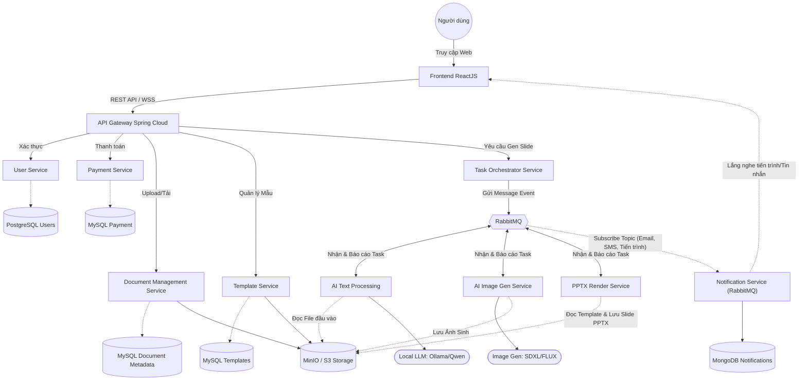
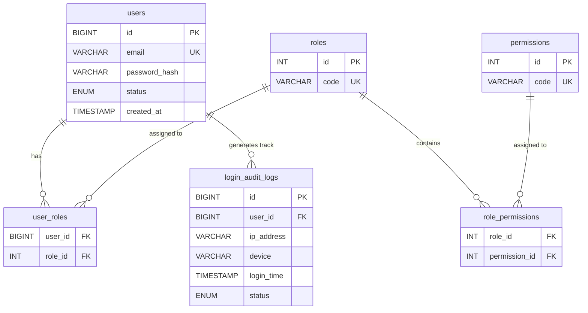
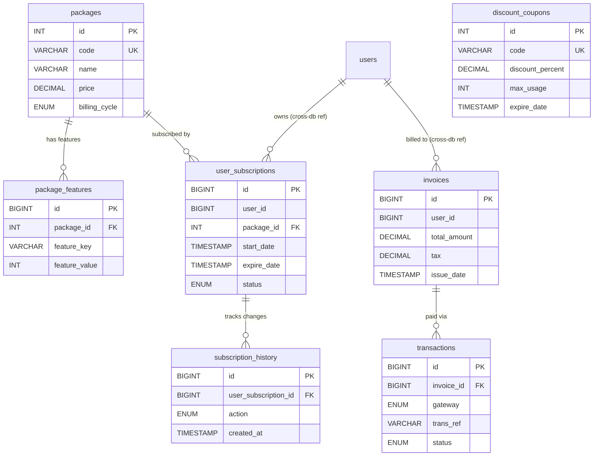
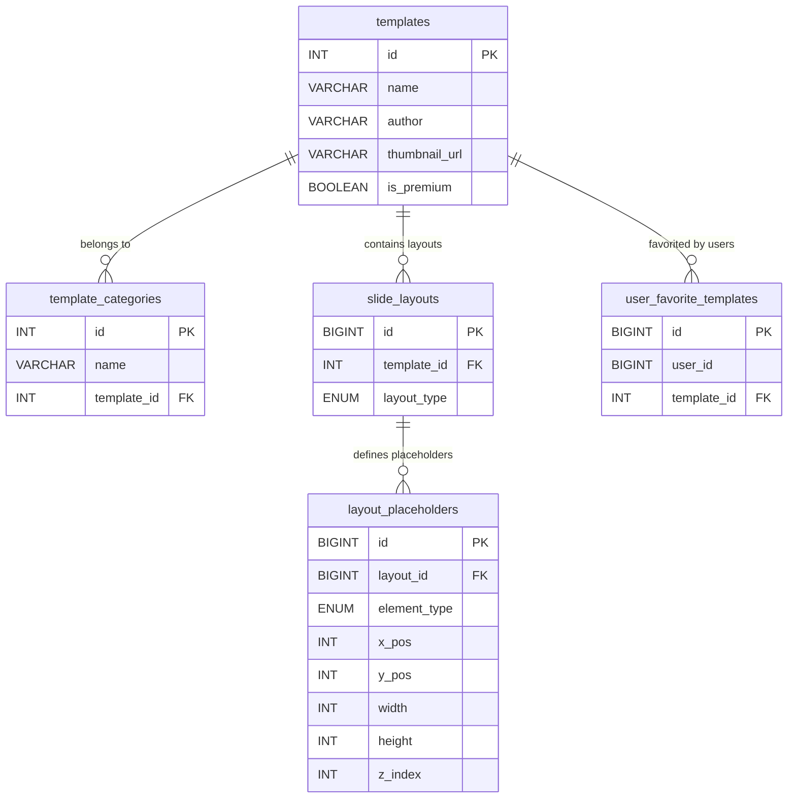
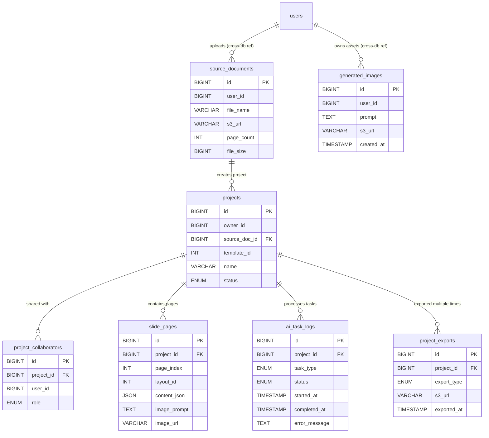

# Kiến trúc Microservices Hệ thống Tạo và Quản lý Slide Tự động (AI-Powered Slide Generator)

## 1. Tổng quan hệ thống
Mục tiêu là xây dựng một hệ thống SaaS cho phép người dùng tải lên tài liệu (DOCX, PDF, Book) hoặc nhập text, sau đó hệ thống sử dụng kết hợp các mô hình AI (Text LLM và Diffusion Models) để tự động sinh ra cấu trúc slide, nội dung và hình ảnh minh họa tương ứng một cách tự động ra định dạng `.pptx`.

Hệ thống được thiết kế theo kiến trúc **Microservices**. Sự lựa chọn Microservices ở đây là rất cần thiết vì backend vừa cần quản lý nghiệp vụ, giao dịch (phù hợp với Java Spring Boot) trực quan, bảo mật; lại vừa cần điều phối các mô hình AI, xử lý dữ liệu nặng (phù hợp với Python FastAPI/Flask).

---

## 2. Thiết kế Kiến Trúc Các Services, Công nghệ & Database

Dưới đây là sơ đồ tổng quan về kiến trúc Microservices và luồng giao tiếp giữa các thành phần:

### 2.1 API Gateway & Nginx (Edge Layer)
- **Công nghệ**: Spring Cloud Gateway.
- **Chức năng**: Entry point duy nhất (Single Entry Point) cho các request từ Frontend (ReactJS + TS). Xử lý routing, rate limiting, CORS. Phân phối tải (Load balancing).

### 2.2 User Service (Core Business)
- **Nhiệm vụ**: Quản lý tài khoản, phân quyền, đăng nhập/đăng ký, xác thực OAuth2/JWT. Quản lý trạng thái thông tin cá nhân.
- **Công nghệ**: Java Spring Boot, Spring Security.
- **Database**: **PostgreSQL** (hoặc MySQL).
  - *Lý do*: Dữ liệu người dùng có tính quan hệ tĩnh, cần đảm bảo ACID. PostgreSQL rất mạnh mẽ cho các truy vấn phức tạp.

### 2.3 Subscription & Payment Service (Core Business)
- **Nhiệm vụ**: Quản lý gói cước (Dùng thử miễn phí, Gói Pro, Gói theo số lượng slide). Tích hợp cổng thanh toán (Stripe, Paypal, VNPAY...). Quản lý quota (tài khoản này còn được tạo bao nhiêu slide).
- **Công nghệ**: Java Spring Boot.
- **Database**: **MySQL**.
  - *Lý do*: Giao dịch tài chính đòi hỏi ACID tuyệt đối, rollback ngay lập tức khi lỗi.

### 2.4 Document & Slide Management Service (Core Business)
- **Nhiệm vụ**: Quản lý repository tài liệu đầu vào (PDF, DOCX) của người dùng, danh sách các slide `.pptx` đã được tạo ra, chia sẻ slide, public/private.
- **Công nghệ**: Java Spring Boot.
- **Database**: **MySQL** kết hợp **Object Storage (AWS S3 / MinIO)**.
  - *Lý do*: S3/MinIO để lưu trữ các tệp vật lý. MySQL lưu trữ metadata (Tên file, Ngày tạo, Tác giả, Link S3), có thể dùng cột kiểu JSON nếu metadata linh hoạt.

### 2.5 Template Service (Core Business)
- **Nhiệm vụ**: Quản lý các mẫu thiết kế slide (thames, layout) cho phép người dùng chọn giao diện slide trước khi tạo. Quản lý màu sắc, font chữ chuẩn.
- **Công nghệ**: Java Spring Boot.
- **Database**: **MySQL** để lưu định nghĩa mẫu và đường dẫn các file template gốc trên **S3**.

### 2.6 Task Orchestrator Service (Orchestration)
- **Nhiệm vụ**: Nhận yêu cầu tạo slide, bóc tách thành các bài toán nhỏ hơn (chia nhỏ task extract text, task gen ảnh) đưa vào Queue. 
- **Công nghệ**: Java Spring Boot.
- **Database**: Gửi message task đến **RabbitMQ**. Sử dụng Redis (lưu Cache trạng thái tạm thời của Task).

### 2.7 Notification Service (Infrastructure)
- **Nhiệm vụ**: Gửi thông báo đa nền tảng (real-time qua WebSocket cho trình duyệt, OTP SMS, Email cho hoá đơn/chúc mừng). Service này **đóng vai trò như một Subscriber mạnh mẽ lắng nghe RabbitMQ (Exchange Topics)**. Mọi service khác (ví dụ Payment Service muốn gửi OTP, Orchestrator muốn báo slide xong %...) đều chỉ cần push event vào RabbitMQ và Notification Service sẽ tự bắt event để phân phối. Điều này đảm bảo Zero-Coupling (không kết nối dính chùm).
- **Công nghệ**: RabbitMQ.
- **Database**: **MongoDB** để lưu thông báo chuông/in-app (notification history, trạng thái đã đọc/chưa đọc). **Redis** để cache Session ID WebSocket và map `user_id -> connection`.

### 2.8 AI Text Processing Service (AI Service)
- **Nhiệm vụ**: 
  - Đọc nội dung file PDF/DOCX (dùng PyPDF2, pdfplumber, python-docx).
  - Tích hợp Text LLM (Qwen / Ollama, Llama 3) để: tóm tắt nội dung, chia thành các phần tương đương với từng trang slide, sinh ra *nội dung text cho slide* và *prompt mô tả* để sinh ảnh minh họa.
  - **Lưu ý**: Service này chỉ sinh ra bản draft nội dung text, **không tự động tiếp tục** sang bước sinh ảnh. Nội dung sẽ được lưu vào DB để người dùng xem và chỉnh sửa trước khi approve.
- **Công nghệ**: Python + FastAPI (rất phù hợp và nhanh gọn cho model inferencing).
- **Database**: Không có DB riêng (Stateless), nhận data từ Queue và trả kết quả về Queue. Document Management Service sẽ lưu nội dung draft vào `slide_pages`.

### 2.7 AI Image Generation Service (AI Service)
- **Nhiệm vụ**: Nhận text prompts từ Queue (đã được Text AI Service sinh ra ở bước trước), load models SDXL (Stable Diffusion XL qua HuggingFace Diffusers) hoặc FLUX. Gen ảnh minh họa chất lượng cao. Đưa ảnh sinh ra lên S3, trả URL về Queue.
- **Công nghệ**: Python + FastAPI (Giao tiếp với GPUs, PyTorch).
- **Database**: Ghi trực tiếp Object Storage (MinIO/S3), Stateless.

### 2.8 PPTX Render Service (Worker)
- **Nhiệm vụ**: Sau khi đã có Outline Text hoàn chỉnh + Link ảnh minh hoạ, Service này ráp tất cả vào Template `.pptx` chuẩn.
- **Công nghệ**: Python (với thư viện `python-pptx`) - thao tác với slide thuận tiện hơn thư viện của Java (Apache POI).
- **Database**: Đẩy file `.pptx` thành phẩm lên MinIO/S3 và báo Task Done cho Task Orchestrator.

---

## 3. Luồng hoạt động (Workflow) – Chi tiết toàn bộ chức năng hệ thống

Phần này liệt kê **tất cả các luồng nghiệp vụ** từ đăng ký/đăng nhập, gói cước, tài liệu, template, sinh slide, chia sẻ, thông báo đến xem/tải slide. Luồng sinh slide chạy bất đồng bộ qua **Message Queue (RabbitMQ)** để tránh timeout do AI xử lý lâu.

---

### 3.1. Luồng Đăng ký và Đăng nhập (User and Auth Service)

| Bước | Hành động                                                                                           | Thành phần tham gia                  | Ghi chú                                               |
| ---- | --------------------------------------------------------------------------------------------------- | ------------------------------------ | ----------------------------------------------------- |
| 1    | User mở form Đăng ký / Đăng nhập                                                                    | Frontend                             | Email + mật khẩu hoặc OAuth (Google, GitHub...)       |
| 2    | Frontend gửi request tới API Gateway                                                                | Frontend → API Gateway               | POST /auth/register hoặc /auth/login                  |
| 3    | Gateway route tới User and Auth Service                                                             | API Gateway → User and Auth Service  | Validate input, rate limit                            |
| 4    | **Đăng ký:** Kiểm tra email chưa tồn tại → hash mật khẩu → tạo user + gán role mặc định (FREE_USER) | User and Auth Service, DB PostgreSQL | Ghi bảng `users`, `user_roles`                        |
| 5    | **Đăng nhập:** Kiểm tra email + mật khẩu → tạo JWT (access + refresh token)                         | User and Auth Service                | Ghi `login_audit_logs` (SUCCESS/FAILED)               |
| 6    | Trả JWT về Frontend, lưu vào storage/cookie                                                         | User and Auth Service → Frontend     | Frontend gửi kèm header Authorization cho các API sau |
| 7    | (Tùy chọn) OAuth: redirect tới IdP → callback → tạo/link user → phát JWT                            | User and Auth Service, OAuth IdP     | Tương đương bước 4–6 với identity bên thứ ba          |

**Luồng bổ sung:** Đổi mật khẩu, Quên mật khẩu (gửi email reset link), Cập nhật thông tin cá nhân, Đăng xuất (vô hiệu hóa token / blacklist refresh token).

---

### 3.2. Luồng Gói cước và Thanh toán (Subscription and Payment Service)

| Bước | Hành động                                                                                        | Thành phần tham gia                                              | Ghi chú                                                                            |
| ---- | ------------------------------------------------------------------------------------------------ | ---------------------------------------------------------------- | ---------------------------------------------------------------------------------- |
| 1    | User xem trang Gói cước (Pricing)                                                                | Frontend                                                         | Gọi API danh sách `packages` + `package_features`                                  |
| 2    | User chọn gói (VD: Pro monthly), (tùy chọn) nhập mã giảm giá                                     | Frontend → API Gateway → Subscription and Payment Service        | Validate coupon `discount_coupons` (còn hạn, còn lượt)                             |
| 3    | Service tạo/ cập nhật `user_subscriptions`, tạo `invoice`                                        | Subscription and Payment Service, MySQL                          | Trạng thái PENDING cho đến khi thanh toán thành công                               |
| 4    | Service tạo URL thanh toán (VNPAY/Stripe/PayPal) và redirect user                                | Subscription and Payment Service → Frontend                      | Frontend chuyển user tới trang cổng thanh toán                                     |
| 5    | User thanh toán trên cổng; cổng gọi webhook / redirect return URL                                | Cổng thanh toán → API Gateway → Subscription and Payment Service | Ghi `transactions` (PENDING → SUCCESS/FAILED)                                      |
| 6    | Service cập nhật trạng thái invoice, subscription (ACTIVE), ghi `subscription_history` (UPGRADE) | Subscription and Payment Service, MySQL                          | Đồng thời có thể gửi event sang RabbitMQ để Notification Service gửi email hóa đơn |
| 7    | (Định kỳ) Cron kiểm tra `expire_date` → gia hạn hoặc đánh dấu EXPIRED, gửi nhắc gia hạn          | Subscription and Payment Service, Notification Service           | Quota (số slide/tháng) lấy từ `package_features` theo gói hiện tại                 |

**Luồng bổ sung:** Hủy gói (CANCEL), Hạ cấp gói (DOWNGRADE), Xem lịch sử hóa đơn và giao dịch, Áp dụng mã giảm giá.

---

### 3.3. Luồng Quản lý tài liệu (Document Management Service)

| Bước | Hành động                                                                                           | Thành phần tham gia                       | Ghi chú                                                          |
| ---- | --------------------------------------------------------------------------------------------------- | ----------------------------------------- | ---------------------------------------------------------------- |
| 1    | User chọn file PDF/DOCX từ máy (hoặc kéo thả)                                                       | Frontend                                  | Validate dung lượng, định dạng phía client                       |
| 2    | Frontend gửi file lên API Gateway (multipart/form-data)                                             | Frontend → API Gateway                    | Header Authorization: JWT                                        |
| 3    | Gateway chuyển tới Document Management Service                                                      | API Gateway → Document Management Service | Service kiểm tra quyền, quota (gọi Subscription Service nếu cần) |
| 4    | Service upload file lên MinIO/S3, nhận `s3_url`                                                     | Document Management Service → MinIO/S3    | Bucket dành cho source documents                                 |
| 5    | Service ghi metadata vào DB: `source_documents` (user_id, file_name, s3_url, page_count, file_size) | Document Management Service, MySQL        | Trả về `document_id` cho Frontend                                |
| 6    | User xem danh sách tài liệu của mình                                                                | Frontend → Document Management Service    | GET /documents, filter theo user_id                              |
| 7    | User xóa / đổi tên tài liệu (nếu cho phép)                                                          | Document Management Service               | Cập nhật DB; có thể soft-delete hoặc xóa file S3 tùy chính sách  |

**Luồng bổ sung:** Tải xuống file gốc từ S3 (pre-signed URL), Phân trang danh sách tài liệu, Lọc theo tên/ngày.

---

### 3.4. Luồng Quản lý Template (Template Service)

| Bước | Hành động                                                                                    | Thành phần tham gia                                      | Ghi chú                                                               |
| ---- | -------------------------------------------------------------------------------------------- | -------------------------------------------------------- | --------------------------------------------------------------------- |
| 1    | User mở màn hình chọn Template (trước hoặc sau khi chọn tài liệu)                            | Frontend                                                 | GET /templates (có thể kèm category)                                  |
| 2    | Template Service trả danh sách templates (name, thumbnail_url, is_premium, categories)       | API Gateway → Template Service → MySQL                   | Join `templates`, `template_categories`, `slide_layouts` nếu cần      |
| 3    | User chọn một template (template_id)                                                         | Frontend                                                 | Lưu tạm hoặc gửi kèm khi tạo project/task sinh slide                  |
| 4    | (Tùy chọn) User thêm/xóa template yêu thích                                                  | Frontend → Template Service                              | Cập nhật `user_favorite_templates` (user_id tham chiếu chéo)          |
| 5    | Khi sinh slide: Task Orchestrator / Document Service gửi template_id cho PPTX Render Service | Template Service, Task Orchestrator, PPTX Render Service | Worker đọc file .pptx gốc từ S3 theo đường dẫn trong Template Service |

**Luồng bổ sung:** Xem chi tiết template (layout placeholders cho admin), Lọc template theo category, Chỉ hiển thị template không premium cho user free (hoặc khóa nút “Dùng” nếu premium).

---

### 3.5. Luồng Sinh Slide Tự Động (Task Orchestrator + AI Workers)

Luồng chính chạy **bất đồng bộ** qua RabbitMQ với **điểm dừng tương tác** (Human-in-the-loop): sau khi AI sinh text, hệ thống dừng lại để người dùng review và chỉnh sửa trước khi tiếp tục sinh ảnh và render slide.

| Bước | Hành động                                                                                                                                                                                                                                            | Thành phần tham gia                                                     | Ghi chú                                                                                                       |
| ---- | ---------------------------------------------------------------------------------------------------------------------------------------------------------------------------------------------------------------------------------------------------- | ----------------------------------------------------------------------- | ------------------------------------------------------------------------------------------------------------- |
| 1    | **Upload và tạo yêu cầu:** User đã đăng nhập, đã có file trong Document Service (hoặc upload ngay). Chọn template, bấm "Tạo slide"                                                                                                                   | Frontend → API Gateway → Document Management Service, Task Orchestrator | Document Service đảm bảo file tồn tại; trừ quota (gọi Subscription and Payment Service)                       |
| 2    | Task Orchestrator tạo bản ghi project (status DRAFT), tạo task tổng (taskId), ghi `ai_task_logs` (EXTRACT_TEXT, PENDING)                                                                                                                             | Task Orchestrator, MySQL/Redis                                          | Trả về `taskId`, `projectId` cho Frontend ngay                                                                |
| 3    | **Đẩy vào Queue:** Task Orchestrator publish message lên RabbitMQ: taskId, projectId, source_doc s3_url, template_id                                                                                                                                 | Task Orchestrator → RabbitMQ                                            | Queue dành cho bước extract text                                                                              |
| 4    | **Text Extraction & Generation:** AI Text Processing Service consume message → tải file từ S3 → đọc nội dung (PyPDF2/pdfplumber/python-docx) → gọi LLM (Ollama/Qwen) → sinh dàn bài JSON (từng slide: nội dung text + prompt ảnh)                     | RabbitMQ → AI Text Processing Service, S3, LLM                          | Cập nhật `ai_task_logs` (EXTRACT_TEXT, PROCESSING → SUCCESS)                                                  |
| 5    | **Lưu Draft Content:** Service gửi kết quả về Task Orchestrator / Document Management Service → lưu vào bảng `slide_pages` (content_json, image_prompt) → cập nhật project status = REVIEWING                                                        | AI Text Processing Service → Document Management Service, MySQL         | **KHÔNG** publish sang queue Image Gen ngay. Pipeline tạm dừng tại đây                                        |
| 6    | **Thông báo Review:** Notification Service gửi event "Nội dung đã sẵn sàng để xem trước" → Frontend hiển thị UI Editor với nội dung text từng slide                                                                                                  | Notification Service → Frontend (WebSocket/SSE)                         | User thấy nút "Xem trước và Chỉnh sửa"                                                                        |
| 7    | **User Review & Edit:** User xem từng slide, chỉnh sửa text/prompt ảnh trực tiếp trên giao diện → Frontend gọi API để cập nhật `slide_pages` (PUT /projects/{id}/slides/{page_index})                                                               | Frontend → API Gateway → Document Management Service                    | Cho phép user sửa nhiều lần. Project vẫn ở trạng thái REVIEWING                                               |
| 8    | **User Approve:** User hài lòng với nội dung → bấm nút "Phê duyệt và Tiếp tục" → Frontend gọi API approve (POST /projects/{id}/approve)                                                                                                              | Frontend → API Gateway → Task Orchestrator                              | Task Orchestrator cập nhật project status = PROCESSING, publish message sang queue Image Gen                  |
| 9    | **Image Generation:** AI Image Gen Service consume → với mỗi slide cần ảnh: đọc `image_prompt` từ DB → gọi SDXL/FLUX sinh ảnh → upload ảnh lên S3 → cập nhật `slide_pages.image_url`                                                                | RabbitMQ → AI Image Gen Service, S3, Diffusers                          | Ghi `generated_images` (user_id, prompt, s3_url) nếu cần lưu thư viện; publish message sang queue PPTX Render |
| 10   | **Slide Assembling:** PPTX Render Service consume → đọc template .pptx từ S3 (theo template_id) → đọc text + image_url từ `slide_pages` → điền vào layout_placeholders → render file .pptx → upload lên S3 → cập nhật project (status DONE), project_exports (PPTX, s3_url) | RabbitMQ → PPTX Render Service, S3, Template metadata                   | `ai_task_logs` (RENDER_PPTX, SUCCESS)                                                                         |
| 11   | **Thông báo tiến trình:** Trong suốt bước 9–10, Task Orchestrator publish event tiến trình (60%, 80%, 100%) lên RabbitMQ → Notification Service subscribe → đẩy qua WebSocket/SSE tới Frontend                                                       | RabbitMQ, Notification Service, Frontend (WebSocket/SSE)                | User thấy thanh tiến trình real-time từ 50% (sau approve) đến 100%                                            |
| 12   | **Hoàn tất:** Notification Service gửi event "Slide đã sẵn sàng" → Frontend cập nhật UI (nút Xem/Tải slide hoàn chỉnh), có thể kèm push/email (tùy cấu hình)                                                                                         | Notification Service → Frontend / Email                                 |                                                                                                               |

**Luồng lỗi:** 
- **Bước 4 lỗi:** Worker ghi `ai_task_logs` (EXTRACT_TEXT, FAILED), project status = DRAFT, báo user "Không thể xử lý tài liệu".
- **Bước 9–10 lỗi:** Ghi `ai_task_logs` (FAILED, error_message), project status = REVIEWING, user có thể sửa lại prompt và retry từ bước 8.
- **User hủy:** User có thể xóa project (status DRAFT/REVIEWING) hoặc để đó, không mất quota cho đến khi approve.

**Lợi ích của luồng mới:**
- **Kiểm soát chất lượng:** User có thể chỉnh sửa nội dung AI sinh ra trước khi tốn tài nguyên GPU sinh ảnh.
- **Tiết kiệm quota:** Chỉ trừ quota khi user approve (bước 8), không phải khi AI sinh draft.
- **Tăng trải nghiệm:** User cảm thấy có quyền kiểm soát hơn, không bị "ép" nhận kết quả tự động.

---

### 3.6. Luồng Chia sẻ và Làm việc nhóm (Document Management / Projects)

| Bước | Hành động                                                                                 | Thành phần tham gia                                  | Ghi chú                                                               |
| ---- | ----------------------------------------------------------------------------------------- | ---------------------------------------------------- | --------------------------------------------------------------------- |
| 1    | Chủ project mở màn hình Chia sẻ, nhập email (hoặc chọn user) và vai trò (EDITOR / VIEWER) | Frontend → API Gateway → Document Management Service | Service có thể gọi User and Auth Service để resolve email → user_id   |
| 2    | Service ghi bảng `project_collaborators` (project_id, user_id, role)                      | Document Management Service, MySQL                   | Trả danh sách collaborator hiện tại                                   |
| 3    | User được mời (đăng nhập) thấy project trong “Được chia sẻ với tôi”                       | Frontend, Document Management Service                | GET /projects/shared, filter theo user_id trong project_collaborators |
| 4    | EDITOR có quyền chỉnh slide (nếu có tính năng edit sau khi gen); VIEWER chỉ xem và tải    | Document Management Service, Frontend                | Phân quyền kiểm tra ở API (project_collaborators.role)                |
| 5    | Chủ project có thể thu hồi quyền (xóa bản ghi project_collaborators) hoặc đổi role        | Document Management Service                          |                                                                       |

**Luồng bổ sung:** Chia sẻ bằng link public (token) với quyền VIEWER, Hết hạn link.

---

### 3.7. Luồng Thông báo (Notification Service)

| Bước | Hành động                                                                                                                                                                                                     | Thành phần tham gia                   | Ghi chú                                                             |
| ---- | ------------------------------------------------------------------------------------------------------------------------------------------------------------------------------------------------------------- | ------------------------------------- | ------------------------------------------------------------------- |
| 1    | Bất kỳ service nào cần gửi thông báo (Payment, Orchestrator, User and Auth...) publish event lên RabbitMQ (Exchange topic) với routing key (vd: notification.email, notification.websocket, notification.sms) | Các Service → RabbitMQ                | Payload: user_id, loại thông báo, nội dung, metadata                |
| 2    | Notification Service subscribe các queue tương ứng (email, websocket, sms)                                                                                                                                    | RabbitMQ → Notification Service       | Decouple hoàn toàn: service gửi không cần biết Notification Service |
| 3    | **Email + Bell notification:** Service gửi email qua SMTP/API (SendGrid, SES...) và đồng thời lưu bản ghi thông báo vào MongoDB collection `notifications`                                                   | Notification Service, SMTP/API, MongoDB | VD: hóa đơn, reset mật khẩu, slide hoàn thành                       |
| 4    | **WebSocket/SSE:** Service map user_id → connection (Redis cache session); đẩy message tới đúng client để hiện thông báo chuông real-time (và cập nhật badge số lượng chưa đọc)                               | Notification Service, Redis, Frontend |                                                                     |
| 5    | **SMS (OTP, nhắc thanh toán):** Gọi gateway SMS, ghi log                                                                                                                                                      | Notification Service, SMS Gateway     |                                                                     |
| 6    | User mở trang “Lịch sử thông báo” (quả chuông) → Frontend gọi API Notification Service → trả danh sách từ MongoDB `notifications` theo `user_id`, `is_read`, `created_at`                                    | Frontend → Notification Service       | Phân trang, lọc theo loại/ngày                                      |

---

### 3.8. Luồng Xem và Tải slide đã tạo (View and Download)

| Bước | Hành động                                                                                                                                                                                    | Thành phần tham gia                                        | Ghi chú                                                                                   |
| ---- | -------------------------------------------------------------------------------------------------------------------------------------------------------------------------------------------- | ---------------------------------------------------------- | ----------------------------------------------------------------------------------------- |
| 1    | User mở danh sách Project/Dashboard → Frontend gọi API Document Management Service (GET /projects?user_id=...)                                                                               | Frontend → Document Management Service                     | Trả danh sách project (name, status, created_at, thumbnail nếu có)                        |
| 2    | User chọn một project (status DONE) → bấm “Xem”                                                                                                                                              | Frontend                                                   | Frontend lấy project_id, gọi API lấy thông tin export (project_exports: PPTX/PDF, s3_url) |
| 3    | **Xem trong trình duyệt:** Frontend lấy pre-signed URL từ backend (Document Management Service hoặc dedicated API) → nhúng viewer (thư viện xem .pptx hoặc convert tạm sang PDF để hiển thị) | Document Management Service, S3 (pre-signed URL), Frontend | Không tải toàn bộ file về máy user                                                        |
| 4    | **Tải xuống:** User bấm “Tải PPTX” (hoặc “Tải PDF” nếu có export PDF) → Backend trả pre-signed URL hoặc redirect → trình duyệt tải file                                                      | Document Management Service, S3                            | Có thể ghi project_exports lần nữa (export_type, exported_at) để audit/quota              |
| 5    | (Tùy chọn) Export PDF: User bấm “Xuất PDF” → Backend đưa job vào queue (PPTX → PDF worker) hoặc gọi sync service → lưu file PDF lên S3 → cập nhật project_exports → trả link tải             | Document Management Service, Worker/Service chuyển PDF, S3 | Quota có thể tính theo số lần export PDF/tháng                                            |

---

### 3.9. Tóm tắt luồng theo chức năng

| Chức năng                   | Luồng chính | Ghi chú                                                        |
| --------------------------- | ----------- | -------------------------------------------------------------- |
| **Đăng ký / Đăng nhập**     | 3.1         | JWT, OAuth, audit log                                          |
| **Gói cước và Thanh toán**  | 3.2         | Package, invoice, gateway, subscription history                |
| **Quản lý tài liệu**        | 3.3         | Upload S3, metadata, danh sách, xóa                            |
| **Quản lý Template**        | 3.4         | Danh sách, chọn, yêu thích; dùng khi sinh slide                |
| **Sinh slide tự động**      | 3.5         | Queue → Text AI → User Review & Edit → User Approve → Image AI → PPTX Render; thông báo tiến trình |
| **Chia sẻ / Làm việc nhóm** | 3.6         | project_collaborators, role EDITOR/VIEWER                      |
| **Thông báo**               | 3.7         | RabbitMQ → Email, WebSocket, SMS, lịch sử                      |
| **Xem và Tải slide**        | 3.8         | Danh sách project, pre-signed URL, viewer, export PDF          |

## 4. Công Nghệ Đề Xuất
* **Frontend:** TypeScript + ReactJS / Next.js (Khuyến khích) hoặc VueJS. Khởi chạy server trên NodeJS.
* **Core Backend API:** Java 17/21 + Spring Boot 3 + Spring Cloud + Hibernate/JPA.
* **AI Worker Backend:** Python 3.10+ + FastAPI.
* **Database Relational:** MySQL 8.
* **Database NoSQL:** MongoDB (ưu tiên cho Notification Service để lưu thông báo chuông/in-app).
* **Cache & Message Broker:** Redis.
* **Object Store:** MinIO (mã nguồn mở giống lệnh AWS S3 để chạy local/on-premise).
* **AI Models:** 
  * Text: Ollama (Qwen2 / Llama-3 / Gemma-2).
  * Image: Diffusers (Stable Diffusion XL / FLUX.1).

---

## 5. Thiết kế Cơ sở dữ liệu (Database Schema)

Dưới đây là chi tiết thiết kế CSDL cho từng bảng thuộc các Microservices, tuân thủ theo nguyên lý **Database-per-Service** của Microservices. (Mỗi service quản lý một cụm DB riêng).

### 5.1. User & Auth Service (Phân quyền chuẩn RBAC)
**Database**: PostgreSQL / MySQL - Quản lý bảo mật, định danh, và phân quyền người dùng.

#### Danh sách các bảng chi tiết:
- **`users`**: Thông tin định danh cốt lõi.
  - `id` (PK, BIGINT)
  - `email` (VARCHAR(100), UNIQUE)
  - `password_hash` (VARCHAR(255))
  - `status` (ENUM: ACTIVE, INACTIVE, BANNED)
  - `created_at` (TIMESTAMP)
- **`roles`**: Master Data chứa các nhóm quyền.
  - `id` (PK, INT)
  - `code` (VARCHAR(50), UNIQUE) - VD: ADMIN, MANAGER, FREE_USER, PRO_USER
- **`permissions`**: Master Data chứa từng hành động cực nhỏ.
  - `id` (PK, INT)
  - `code` (VARCHAR(50), UNIQUE) - VD: EXPORT_PPTX, GEN_IMAGE_FLUX, UPLOAD_PDF_100MB
- **`user_roles`**: Bảng nối N-N giữa User và Role. (Một user có thể có nhiều role).
  - `user_id` (FK -> users.id)
  - `role_id` (FK -> roles.id)
- **`role_permissions`**: Bảng nối N-N giữa Role và Permission. (Khi user up lên gói Pro, chỉ cần gán role PRO_USER là có trọn quyền).
  - `role_id` (FK -> roles.id)
  - `permission_id` (FK -> permissions.id)
- **`login_audit_logs`**: Lưu vết bảo mật hệ thống.
  - `id` (PK, BIGINT)
  - `user_id` (FK -> users.id)
  - `ip_address` (VARCHAR(45))
  - `device` (VARCHAR(255))
  - `login_time` (TIMESTAMP)
  - `status` (ENUM: SUCCESS, FAILED)

#### Sơ đồ Entity-Relationship (ERD):

---

### 5.2. Subscription & Payment Service (Billing & Quota)
**Database**: MySQL - Thiết kế bóc tách rõ ràng giữa Kế hoạch (Package), Vận hành (Subscription), và Giao dịch tài chính (Transaction).

#### Danh sách các bảng chi tiết:
- **`packages`**: Master Data các gói cước.
  - `id` (PK, INT)
  - `code` (VARCHAR(50), UNIQUE)
  - `name` (VARCHAR(100))
  - `price` (DECIMAL)
  - `billing_cycle` (ENUM: MONTHLY, YEARLY)
- **`package_features`**: Giới hạn cụ thể của từng gói.
  - `id` (PK, BIGINT)
  - `package_id` (FK -> packages.id)
  - `feature_key` (VARCHAR(50)) - VD: MAX_SLIDES_PER_MONTH
  - `feature_value` (INT) - VD: 50
- **`user_subscriptions`**: Gói cước user đang sử dụng hiện tại.
  - `id` (PK, BIGINT)
  - `user_id` (BIGINT, Index) *(ID tham chiếu chéo tới Core User)*
  - `package_id` (FK -> packages.id)
  - `start_date` (TIMESTAMP)
  - `expire_date` (TIMESTAMP)
  - `status` (ENUM: ACTIVE, EXPIRED)
- **`subscription_history`**: Lưu vết mỗi khi user nâng cấp/hạ cấp gói. Bắt buộc để truy thu / giải quyết khiếu nại.
  - `id` (PK, BIGINT)
  - `user_subscription_id` (FK -> user_subscriptions.id)
  - `action` (ENUM: UPGRADE, DOWNGRADE, CANCEL)
  - `created_at` (TIMESTAMP)
- **`invoices`**: Hóa đơn pháp lý sinh ra mỗi chu kỳ.
  - `id` (PK, BIGINT)
  - `user_id` (BIGINT, Index)
  - `total_amount` (DECIMAL)
  - `tax` (DECIMAL)
  - `issue_date` (TIMESTAMP)
- **`transactions`**: Lịch sử gọi cổng thanh toán.
  - `id` (PK, BIGINT)
  - `invoice_id` (FK -> invoices.id)
  - `gateway` (ENUM: VNPAY, STRIPE, PAYPAL)
  - `trans_ref` (VARCHAR(100))
  - `status` (ENUM: PENDING, SUCCESS, FAILED)
- **`discount_coupons`**: Mã giảm giá cho marketing.
  - `id` (PK, INT)
  - `code` (VARCHAR(50), UNIQUE)
  - `discount_percent` (DECIMAL)
  - `max_usage` (INT)
  - `expire_date` (TIMESTAMP)

#### Sơ đồ Entity-Relationship (ERD):

---

### 5.3. Template & Asset Service (Quản lý Giao diện)
**Database**: MySQL - Tách bạch Template ra khỏi các Slide Layout để thư viện Python (python-pptx) dễ dàng đọc tọa độ x, y.

#### Danh sách các bảng chi tiết:
- **`templates`**: Thông tin tổng quan bộ giao diện.
  - `id` (PK, INT)
  - `name` (VARCHAR(100))
  - `author` (VARCHAR(100))
  - `thumbnail_url` (VARCHAR(255))
  - `is_premium` (BOOLEAN)
- **`template_categories`**: Phân loại Template theo ngành nghề (Công nghệ, Y tế, Giáo dục...).
  - `id` (PK, INT)
  - `name` (VARCHAR(100))
  - `template_id` (FK -> templates.id)
- **`slide_layouts`**: Các loại bố cục bên trong 1 template.
  - `id` (PK, BIGINT)
  - `template_id` (FK -> templates.id)
  - `layout_type` (ENUM: TITLE, 2_COLUMN, IMAGE_RIGHT)
- **`layout_placeholders`**: Tọa độ chính xác để chèn nội dung. Worker sẽ chọc vào bảng này để map Text/Image.
  - `id` (PK, BIGINT)
  - `layout_id` (FK -> slide_layouts.id)
  - `element_type` (ENUM: TEXT, IMAGE)
  - `x_pos` (INT)
  - `y_pos` (INT)
  - `width` (INT)
  - `height` (INT)
  - `z_index` (INT)
- **`user_favorite_templates`**: UX cá nhân hóa lưu template yêu thích.
  - `id` (PK, BIGINT)
  - `user_id` (BIGINT, Index) *(ID tham chiếu chéo)*
  - `template_id` (FK -> templates.id)

#### Sơ đồ Entity-Relationship (ERD):

---

### 5.4. Document Management & Orchestration Service (Xử lý Nhiệm vụ AI)
**Database**: MySQL/MongoDB - Trái tim hệ thống, quản lý tài liệu, làm việc nhóm, và theo dõi tiến trình sinh Slide của Qwen/FLUX.

#### Danh sách các bảng chi tiết:
- **`source_documents`**: File gốc do người dùng tải lên.
  - `id` (PK, BIGINT)
  - `user_id` (BIGINT, Index)
  - `file_name` (VARCHAR(255))
  - `s3_url` (VARCHAR(255))
  - `page_count` (INT)
  - `file_size` (BIGINT)
- **`projects`** (Slide Projects): Không gian làm việc chính (Workspace) một File Trình Chiếu.
  - `id` (PK, BIGINT)
  - `owner_id` (BIGINT, Index)
  - `source_doc_id` (FK -> source_documents.id)
  - `template_id` (INT)
  - `name` (VARCHAR(255))
  - `status` (ENUM: DRAFT, REVIEWING, PROCESSING, DONE)
- **`project_collaborators`**: Tính năng share dự án (Làm việc nhóm).
  - `id` (PK, BIGINT)
  - `project_id` (FK -> projects.id)
  - `user_id` (BIGINT, Index)
  - `role` (ENUM: EDITOR, VIEWER)
- **`slide_pages`**: Nội dung của từng trang chi tiết.
  - `id` (PK, BIGINT)
  - `project_id` (FK -> projects.id)
  - `page_index` (INT)
  - `layout_id` (INT)
  - `content_json` (JSON)
  - `image_prompt` (TEXT)
  - `image_url` (VARCHAR(255))
- **`ai_task_logs`**: Bảng Operation Audit Queue. Hệ thống sập bước nào có thể query ra ngay.
  - `id` (PK, BIGINT)
  - `project_id` (FK -> projects.id)
  - `task_type` (ENUM: EXTRACT_TEXT, GEN_IMAGE, RENDER_PPTX)
  - `status` (ENUM: PENDING, PROCESSING, SUCCESS, FAILED)
  - `started_at` (TIMESTAMP)
  - `completed_at` (TIMESTAMP)
  - `error_message` (TEXT)
- **`generated_images`**: Thư viện ảnh AI sinh ra để tái lưu trữ dùng cho project khác.
  - `id` (PK, BIGINT)
  - `user_id` (BIGINT, Index)
  - `prompt` (TEXT)
  - `s3_url` (VARCHAR(255))
  - `created_at` (TIMESTAMP)
- **`project_exports`**: Lịch sử xuất lưu trữ để quản lý Quota Billing (Export ra PPT/PDF).
  - `id` (PK, BIGINT)
  - `project_id` (FK -> projects.id)
  - `export_type` (ENUM: PPTX, PDF)
  - `s3_url` (VARCHAR(255))
  - `exported_at` (TIMESTAMP)

#### Sơ đồ Entity-Relationship (ERD):

---

### 5.5. Notification Service (Bell Notifications)
**Database**: MongoDB - Tối ưu lưu thông báo chuông/in-app theo dạng document, hỗ trợ đọc nhanh theo `user_id`, lọc `is_read` và sắp xếp theo thời gian.

#### Danh sách collection chi tiết:
- **`notifications`**: Nội dung thông báo hiển thị ở quả chuông.
  - `_id` (ObjectId)
  - `user_id` (BIGINT/String, Index)
  - `type` (String) - VD: BILLING, TASK_PROGRESS, SYSTEM
  - `title` (String)
  - `body` (String)
  - `metadata` (Object) - lưu `project_id`, `task_id`, `invoice_id`...
  - `channels` (Array<String>) - VD: ["BELL", "EMAIL"]
  - `is_read` (Boolean, Default `false`)
  - `read_at` (Date, nullable)
  - `created_at` (Date, Index)
- **`notification_delivery_logs`**: Nhật ký gửi theo kênh để debug/retry.
  - `_id` (ObjectId)
  - `notification_id` (ObjectId, Ref `notifications._id`)
  - `channel` (String) - EMAIL/WEBSOCKET/SMS
  - `status` (String) - PENDING/SENT/FAILED
  - `error_message` (String, nullable)
  - `created_at` (Date)

#### Gợi ý index:
- `notifications`: `{ user_id: 1, is_read: 1, created_at: -1 }`
- `notification_delivery_logs`: `{ notification_id: 1, channel: 1, created_at: -1 }`
