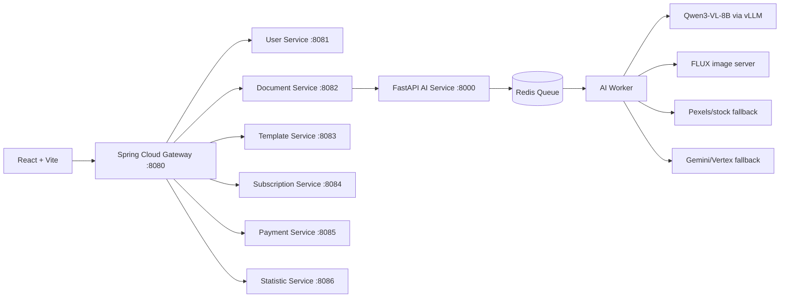

# LecGen

LecGen la he thong tao, quan ly va chinh sua bai giang/bai thuyet trinh bang AI. Nguoi dung co the nhap prompt, dung lai tai lieu da tai len hoac gui PDF/DOCX/TXT; he thong tra ve deck JSON de giao dien web render, chinh sua va xuat PDF/PPTX.

## Kien truc hien tai


```mermaid
flowchart LR
    FE[React + Vite] --> GW[Spring Cloud Gateway :8080]
    GW --> USER[User Service :8081]
    GW --> DOC[Document Service :8082]
    GW --> TEMPLATE[Template Service :8083]
    GW --> SUB[Subscription Service :8084]
    GW --> PAY[Payment Service :8085]
    GW --> STAT[Statistic Service :8086]
    DOC --> AI[FastAPI AI Service :8000]
    AI --> REDIS[(Redis Queue)]
    REDIS --> WORKER[AI Worker]
    WORKER --> VLLM[Qwen3-VL-8B via vLLM]
    WORKER --> FLUX[FLUX image server]
    WORKER --> STOCK[Pexels/stock fallback]
    WORKER --> GEMINI[Gemini/Vertex fallback]
```

- FE chi goi Java BE qua API Gateway; khong goi AI Service truc tiep.
- Document Service luu project, slide pages va dieu phoi task AI.
- AI Service sinh deck JSON, bang, bieu do, anh va speaker notes. FE chiu trach nhiem render/editor/export.
- Qwen3-VL la provider chinh; Gemini/Vertex la fallback va lop review khi cau hinh cho phep.
- FLUX sinh anh tong quat; anh stock/nguon tai lieu duoc uu tien khi can tinh xac thuc.
- Redis Queue tach API khoi cac tac vu AI dai.

## Thu muc

```text
back-end/       Java microservices
front-end/      React/Vite application
ai-service/     FastAPI, worker va AI pipeline
docker/         Database initialization
docker-compose.yml
fe_api_spec.md  Contract FE -> Java BE (source of truth)
ai-service/api_specification.md  Contract Java BE -> AI Service
```

## Chay local

### 1. Java backend va infrastructure

Tao `.env` o thu muc goc, sau do:

```bash
docker compose up -d --build
```

Gateway: `http://localhost:8080`.

### 2. AI Service

Tao `ai-service/.env` va `ai-service/backend/.env` theo moi truong cua ban. Cac bien quan trong:

```env
REDIS_URL=redis://redis:6379/0
LLM_MODEL=Qwen3-VL-8B
VLLM_API_BASE_URL=http://<vllm-host>:<port>
IMAGE_GEN_API_BASE_URL=http://<flux-host>:<port>
```

```bash
cd ai-service
docker compose up -d --build api worker redis
```

AI Swagger: `http://localhost:8000/docs`.

### 3. Frontend

```bash
cd front-end
npm ci
npm run dev -- --host 0.0.0.0 --port 5173
```

Mac dinh FE dung hostname hien tai va gateway port `8080`. Chi dat `VITE_API_BASE_URL` neu gateway nam o URL khac.

## Luong tao slide

1. FE upload tai lieu neu co.
2. FE goi `POST /api/document/projects` voi prompt va metadata file.
3. FE poll `GET /api/document/projects/{projectId}/progress`.
4. Khi `projectStatus=1` va `aiStatus=completed`, FE lay `/pages` va render deck.
5. FE autosave thay doi thu cong qua API pages/sync.
6. FE xuat PDF hoac PPTX tu editor. PPTX editable dung cac object PowerPoint; chi tiet trang tri phuc tap co the duoc flatten de giu hinh anh.

## Luong sua bang AI

1. FE goi `POST /api/document/projects/{projectId}/revise`.
2. Gui `revisionScope="auto"`; `contextSlideNumber` chi la slide dang mo, khong khoa target.
3. AI tu hieu can sua mot slide, nhieu slide, them/xoa slide hay toan deck.
4. FE poll progress, sau do tai lai toan bo `/pages` thay vi merge delta.
5. Neu revise that bai, BE khoi phuc `aiTaskId` cua deck thanh cong gan nhat de nguoi dung co the sua tiep.

## Chat luong va an toan du lieu

- Table/chart chi duoc tra ve khi co schema day du va du lieu co bang chung.
- Neu chart bi loai, noi dung khong con hua hen mot bieu do khong ton tai.
- Pipeline khong duoc tu bia thong ke, ty le, ngay thang, nghien cuu hoac ket qua do luong.
- Slide khong nam trong pham vi revise duoc giu nguyen theo `slide_id`.
- File nguon co the duoc tai su dung tu trang Tai lieu, khong can upload lai.

## Goi va gioi han AI

Gia tri mac dinh trong AI Service (co the doi bang environment):

| Plan | Slide toi da | Ky tu toi da | Anh toi da | Ti le slide co anh |
|---|---:|---:|---:|---:|
| Free | 10 | 10,000 | 5 | 40% |
| Pro | 30 | 50,000 | 15 | 60% |
| Ultra | 50 | 100,000 | 35 | 80% |

Quota nghiep vu va quyen plan duoc Java Subscription Service xac dinh tu tai khoan da dang nhap; FE khong duoc tu gui plan.

## Tai lieu tich hop

- [README_FE_API.md](README_FE_API.md): checklist nhanh cho FE.
- [fe_api_spec.md](fe_api_spec.md): contract FE -> Java BE.
- [ai-service/api_specification.md](ai-service/api_specification.md): contract Java BE -> AI Service.
- [back-end/document-service/document_api_spec.md](back-end/document-service/document_api_spec.md): chi tiet Document Service.
- [ai-service/README.md](ai-service/README.md): van hanh AI/vLLM/FLUX.
