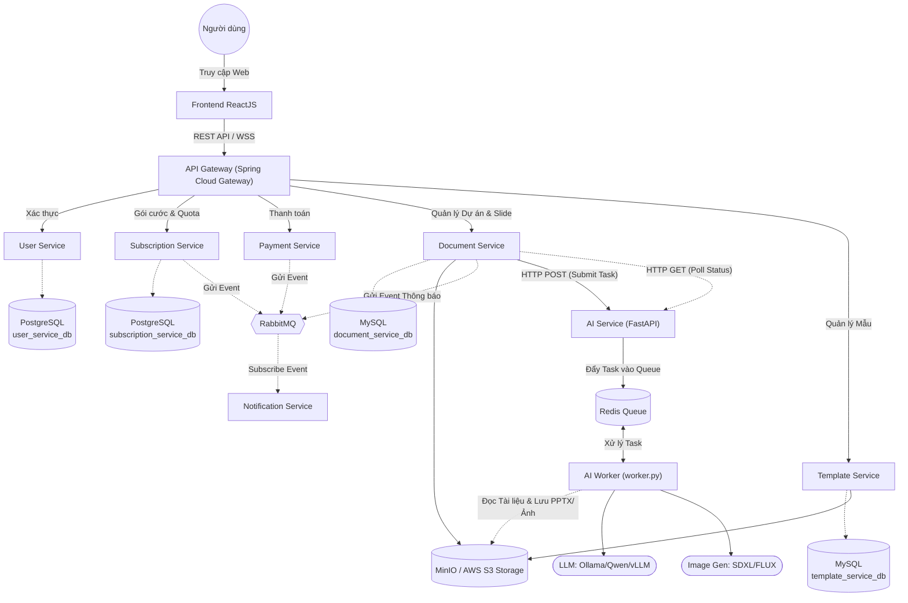
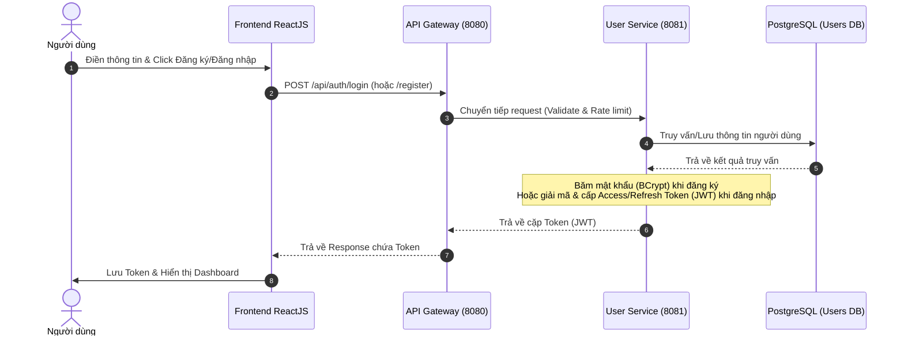
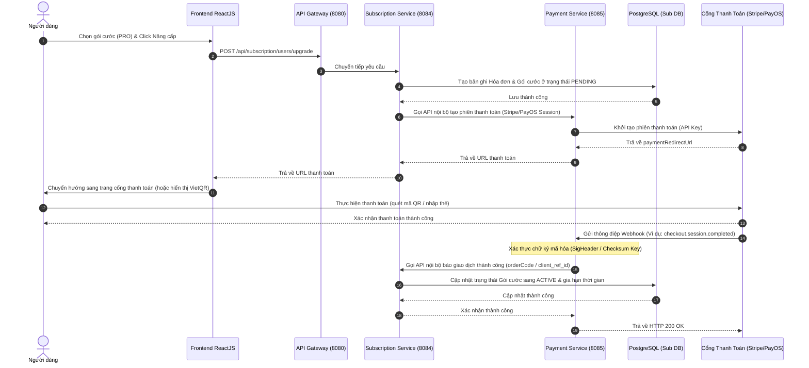
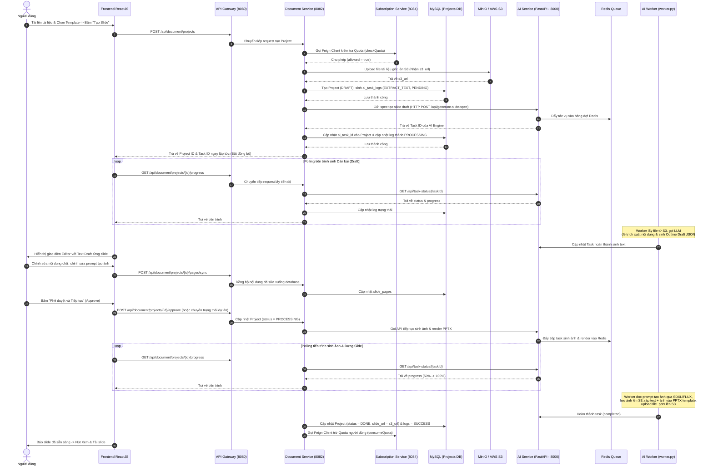
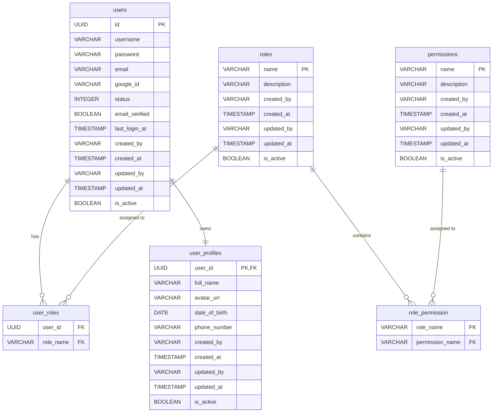
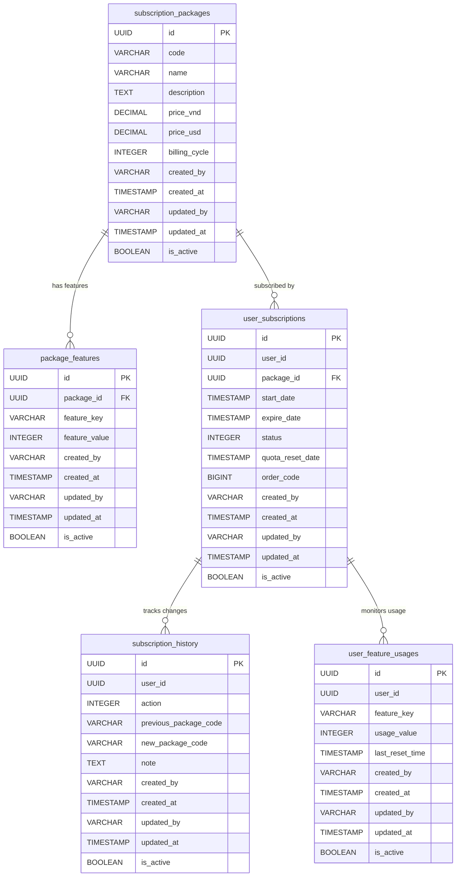
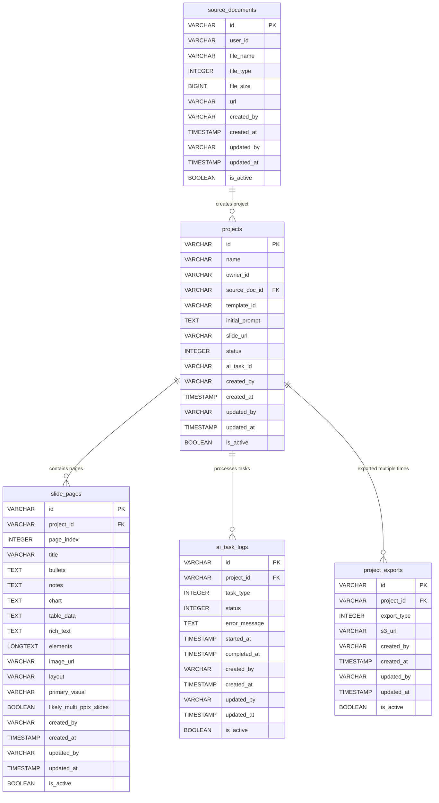
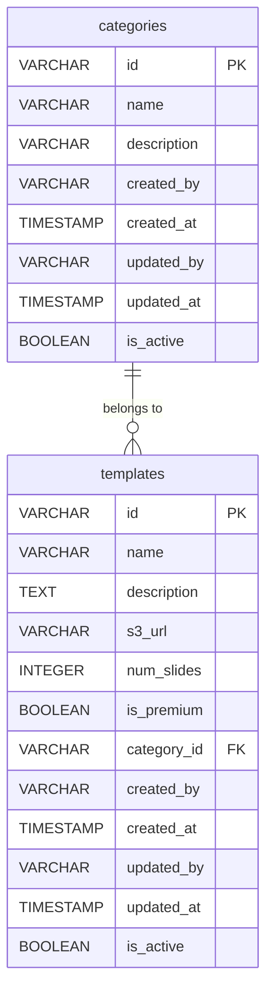

# Kiến trúc Microservices Hệ thống Tạo và Quản lý Slide Tự động (AI-Powered Slide Generator)

## 1. Tổng quan hệ thống
Mục tiêu là xây dựng một hệ thống SaaS cho phép người dùng tải lên tài liệu (DOCX, PDF, TXT) hoặc nhập văn bản gợi ý (Prompt), sau đó hệ thống sử dụng kết hợp các mô hình AI (Text LLM và Diffusion Models) để tự động sinh ra cấu trúc slide, nội dung và hình ảnh minh họa tương ứng một cách tự động ra định dạng `.pptx`.

Hệ thống được thiết kế theo kiến trúc **Microservices** phân tán. Sự lựa chọn Microservices ở đây là rất cần thiết vì backend vừa cần quản lý nghiệp vụ, giao dịch thanh toán (phù hợp với Java Spring Boot) trực quan, bảo mật; lại vừa cần điều phối các mô hình AI, xử lý dữ liệu nặng và làm việc trực tiếp với GPU (phù hợp với Python FastAPI).

---

## 2. Thiết kế Kiến Trúc Các Services, Công nghệ & Database

Dưới đây là sơ đồ tổng quan về kiến trúc Microservices và luồng giao tiếp thực tế giữa các thành phần:


```mermaid
graph TD
  %% -------------------
  %% LAYER 1: CLIENT
  %% -------------------
  User((Người dùng)) -->|"Truy cập Web"| FE["Frontend ReactJS"]
  
  %% -------------------
  %% LAYER 2: EDGE GATEWAY
  %% -------------------
  FE -->|"REST API / WSS"| AG["API Gateway (Spring Cloud Gateway)"]
  
  %% -------------------
  %% LAYER 3: CORE SERVICES (Java Spring Boot)
  %% -------------------
  AG -->|"Xác thực"| UA["User Service"]
  AG -->|"Gói cước & Quota"| SUB["Subscription Service"]
  AG -->|"Thanh toán"| PAY["Payment Service"]
  AG -->|"Quản lý Dự án & Slide"| DM["Document Service"]
  AG -->|"Quản lý Mẫu"| TM["Template Service"]
  
  %% -------------------
  %% LAYER 4: DATABASES (Database-per-Service)
  %% -------------------
  UA -.-> DB_UA[("PostgreSQL<br/>user_service_db")]
  SUB -.-> DB_SUB[("PostgreSQL<br/>subscription_service_db")]
  DM -.-> DB_DM[("MySQL<br/>document_service_db")]
  TM -.-> DB_TM[("MySQL<br/>template_service_db")]
  
  %% -------------------
  %% LAYER 5: STORAGE, BROKER & CACHE (Async / Infrastructure)
  %% -------------------
  DM --> S3[("MinIO / AWS S3 Storage")]
  TM --> S3
  
  DM -.->|"Gửi Event Thông báo"| MQ{{"RabbitMQ"}}
  SUB -.->|"Gửi Event"| MQ
  PAY -.->|"Gửi Event"| MQ
  
  MQ -.->|"Subscribe Event"| NS["Notification Service"]
  
  %% -------------------
  %% LAYER 6: AI SERVICES (Python FastAPI + Redis Queue)
  %% -------------------
  DM -->|"HTTP POST (Submit Task)"| AI_API["AI Service (FastAPI)"]
  DM -.->|"HTTP GET (Poll Status)"| AI_API
  
  AI_API -->|"Đẩy Task vào Queue"| RD[("Redis Queue")]
  RD <-->|"Xử lý Task"| AI_Worker["AI Worker (worker.py)"]
  
  AI_Worker -.->|"Đọc Tài liệu & Lưu PPTX/Ảnh"| S3
  AI_Worker --> LLM(["LLM: Ollama/Qwen/vLLM"])
  AI_Worker --> Diffusers(["Image Gen: SDXL/FLUX"])
```

### 2.1 API Gateway (Edge Layer)
- **Công nghệ**: Spring Cloud Gateway.
- **Cổng**: `8080` (Biến `GATEWAY_PORT`).
- **Chức năng**: Entry point duy nhất cho các request từ Frontend (ReactJS). Xử lý routing định tuyến, rate limiting, CORS và giải mã / xác thực JWT tập trung.

### 2.2 User Service (Core Business)
- **Nhiệm vụ**: Quản lý tài khoản, phân quyền dựa trên vai trò (RBAC), đăng nhập/đăng ký, xác thực JWT.
- **Công nghệ**: Java Spring Boot, Spring Security.
- **Database**: **PostgreSQL** (`user_service_db`).
  - *Lý do*: Đảm bảo tính nhất quán (ACID), bảo mật dữ liệu người dùng cực cao.

### 2.3 Subscription Service (Core Business)
- **Nhiệm vụ**: Quản lý gói cước dịch vụ (Free, Pro, Enterprise) và kiểm duyệt hạn mức sử dụng (Quota check). Cung cấp các API nội bộ cho các dịch vụ khác (như `document-service`) để trừ / hoàn trả hạn mức.
- **Công nghệ**: Java Spring Boot, Spring Data JPA.
- **Database**: **PostgreSQL** (`subscription_service_db`).
  - *Lý do*: Đảm bảo tính ACID, đồng bộ hóa tốt với dữ liệu người dùng.

### 2.4 Payment Service (Core Business)
- **Nhiệm vụ**: Tích hợp trực tiếp các cổng thanh toán Stripe & PayOS. Xử lý webhook phản hồi từ cổng thanh toán để kích hoạt gói.
- **Công nghệ**: Java Spring Boot, Stripe Java SDK, PayOS Java SDK.
- **Database**: Không sử dụng trực tiếp (Stateless), gọi API nội bộ sang Subscription Service để lưu giao dịch và kích hoạt gói cước.

### 2.5 Document Service (Core Business & Orchestrator)
- **Nhiệm vụ**: Quản lý không gian làm việc thiết kế slide (Project Workspace), lưu trữ tài liệu tải lên của khách hàng, lưu trữ cấu trúc trang slide. Đóng vai trò **Bộ điều phối (Orchestrator)** gọi bất đồng bộ tới AI Service qua HTTP REST và thực hiện cơ chế Polling để giám sát tiến độ.
- **Công nghệ**: Java Spring Boot, AWS S3 Java SDK.
- **Database**: **MySQL** (`document_service_db`) kết hợp với **Object Storage (MinIO / S3)**.
  - *Lý do*: MySQL lưu trữ siêu dữ liệu (metadata) linh hoạt và hỗ trợ kiểu cột JSON rất tốt, Object Storage để lưu trữ các file cứng (.docx, .pdf, .pptx).

### 2.6 Template Service (Core Business)
- **Nhiệm vụ**: Quản lý kho mẫu slide thiết kế (Themes, Layouts, Placeholders) và tọa độ các vị trí chèn nội dung trên slide.
- **Công nghệ**: Java Spring Boot.
- **Database**: **MySQL** (`template_service_db`).

### 2.7 Notification Service (Infrastructure)
- **Nhiệm vụ**: Gửi email thông báo tự động (email hóa đơn, xác thực hoặc báo slide hoàn thành) bằng cách đăng ký lắng nghe sự kiện từ hàng đợi RabbitMQ.
- **Công nghệ**: Java Spring Boot, Spring AMQP (RabbitMQ Consumer), Java Mail Sender, Thymeleaf HTML Template.
- **Database**: Stateless (không có DB riêng).

### 2.8 AI Service (Python FastAPI & Worker)
- **Nhiệm vụ**: 
  - **AI Text Processing**: Đọc nội dung file PDF/DOCX, gọi LLM (Ollama/Qwen) sinh cấu trúc dàn ý dạng JSON (tiêu đề, nội dung text, và prompt ảnh).
  - **AI Image Generation**: Sử dụng mô hình khuếch tán (SDXL/FLUX) tạo ảnh minh họa từ prompt.
  - **PPTX Render**: Sử dụng thư viện `python-pptx` để chèn chữ và ảnh vào đúng tọa độ của template slide PowerPoint, upload thành phẩm lên S3.
- **Công nghệ**: Python, FastAPI, Redis (dùng hàng đợi rq-worker để chạy bất đồng bộ tác vụ nặng).

---

## 3. Luồng hoạt động (Workflow) & Sơ đồ Sequence Diagrams

### 3.1. Luồng Đăng ký và Đăng nhập (User Service)

```mermaid
sequenceDiagram
    autonumber
    actor User as Người dùng
    participant FE as Frontend ReactJS
    participant AG as API Gateway (8080)
    participant UA as User Service (8081)
    participant PG as PostgreSQL (Users DB)

    User->>FE: Điền thông tin & Click Đăng ký/Đăng nhập
    FE->>AG: POST /api/auth/login (hoặc /register)
    AG->>UA: Chuyển tiếp request (Validate & Rate limit)
    UA->>PG: Truy vấn/Lưu thông tin người dùng
    PG-->>UA: Trả về kết quả truy vấn
    Note over UA: Băm mật khẩu (BCrypt) khi đăng ký<br/>Hoặc giải mã & cấp Access/Refresh Token (JWT) khi đăng nhập
    UA-->>AG: Trả về cặp Token (JWT)
    AG-->>FE: Trả về Response chứa Token
    FE->>User: Lưu Token & Hiển thị Dashboard
```
- **Bước bổ sung**: Đổi mật khẩu, quên mật khẩu (gửi mail link reset mật khẩu qua RabbitMQ ➔ Notification Service), đăng xuất (vô hiệu hóa token).

---

### 3.2. Luồng Gói cước và Thanh toán (Subscription & Payment Service)

```mermaid
sequenceDiagram
    autonumber
    actor User as Người dùng
    participant FE as Frontend ReactJS
    participant AG as API Gateway (8080)
    participant SUB as Subscription Service (8084)
    participant PAY as Payment Service (8085)
    participant PG as PostgreSQL (Sub DB)
    participant Gateway as Cổng Thanh Toán (Stripe/PayOS)

    User->>FE: Chọn gói cước (PRO) & Click Nâng cấp
    FE->>AG: POST /api/subscription/users/upgrade
    AG->>SUB: Chuyển tiếp yêu cầu
    SUB->>PG: Tạo bản ghi Hóa đơn & Gói cước ở trạng thái PENDING
    PG-->>SUB: Lưu thành công
    SUB->>PAY: Gọi API nội bộ tạo phiên thanh toán (Stripe/PayOS Session)
    PAY->>Gateway: Khởi tạo phiên thanh toán (API Key)
    Gateway-->>PAY: Trả về paymentRedirectUrl
    PAY-->>SUB: Trả về URL thanh toán
    SUB-->>FE: Trả về URL thanh toán
    FE->>User: Chuyển hướng sang trang cổng thanh toán (hoặc hiển thị VietQR)
    User->>Gateway: Thực hiện thanh toán (quét mã QR / nhập thẻ)
    Gateway-->>User: Xác nhận thanh toán thành công
    Gateway->>PAY: Gửi thông điệp Webhook (Ví dụ: checkout.session.completed)
    Note over PAY: Xác thực chữ ký mã hóa (SigHeader / Checksum Key)
    PAY->>SUB: Gọi API nội bộ báo giao dịch thành công (orderCode / client_ref_id)
    SUB->>PG: Cập nhật trạng thái Gói cước sang ACTIVE & gia hạn thời gian
    PG-->>SUB: Cập nhật thành công
    SUB-->>PAY: Xác nhận thành công
    PAY-->>Gateway: Trả về HTTP 200 OK
```

---

### 3.3. Luồng Sinh Slide Tự Động (Human-in-the-loop)
Hệ thống sử dụng luồng thiết kế **kiểm soát trung gian** để tối ưu hóa tài nguyên GPU:


```mermaid
sequenceDiagram
    autonumber
    actor User as Người dùng
    participant FE as Frontend ReactJS
    participant AG as API Gateway (8080)
    participant DM as Document Service (8082)
    participant SUB as Subscription Service (8084)
    participant MY as MySQL (Projects DB)
    participant S3 as MinIO / AWS S3
    participant AI as AI Service (FastAPI - 8000)
    participant RD as Redis Queue
    participant Worker as AI Worker (worker.py)

    User->>FE: Tải lên tài liệu & Chọn Template -> Bấm "Tạo Slide"
    FE->>AG: POST /api/document/projects
    AG->>DM: Chuyển tiếp request tạo Project
    DM->>SUB: Gọi Feign Client kiểm tra Quota (checkQuota)
    SUB-->>DM: Cho phép (allowed = true)
    DM->>S3: Upload file tài liệu gốc lên S3 (Nhận s3_url)
    S3-->>DM: Trả về s3_url
    DM->>MY: Tạo Project (DRAFT), sinh ai_task_logs (EXTRACT_TEXT, PENDING)
    MY-->>DM: Lưu thành công
    DM->>AI: Gửi spec tạo slide draft (HTTP POST /api/generate-slide-spec)
    AI->>RD: Đẩy tác vụ vào hàng đợi Redis
    AI-->>DM: Trả về Task ID của AI Engine
    DM->>MY: Cập nhật ai_task_id vào Project & cập nhật log thành PROCESSING
    MY-->>DM: Lưu thành công
    DM-->>FE: Trả về Project ID & Task ID ngay lập tức (Bất đồng bộ)
    
    loop Polling tiến trình sinh Dàn bài (Draft)
        FE->>AG: GET /api/document/projects/{id}/progress
        AG->>DM: Chuyển tiếp request lấy tiến độ
        DM->>AI: GET /api/task-status/{taskId}
        AI-->>DM: Trả về status & progress
        DM->>MY: Cập nhật log trạng thái
        DM-->>FE: Trả về tiến trình
    end

    Note over Worker: Worker lấy file từ S3, gọi LLM<br/>để trích xuất nội dung & sinh Outline Draft JSON
    Worker->>AI: Cập nhật Task hoàn thành sinh text
    
    FE->>User: Hiển thị giao diện Editor với Text Draft từng slide
    User->>FE: Chỉnh sửa nội dung chữ, chỉnh sửa prompt tạo ảnh
    FE->>AG: POST /api/document/projects/{id}/pages/sync
    AG->>DM: Đồng bộ nội dung đã sửa xuống database
    DM->>MY: Cập nhật slide_pages
    
    User->>FE: Bấm "Phê duyệt và Tiếp tục" (Approve)
    FE->>AG: POST /api/document/projects/{id}/approve (hoặc chuyển trạng thái dự án)
    AG->>DM: Cập nhật Project (status = PROCESSING)
    DM->>AI: Gọi API tiếp tục sinh ảnh & render PPTX
    AI->>RD: Đẩy tiếp task sinh ảnh & render vào Redis
    
    loop Polling tiến trình sinh Ảnh & Dựng Slide
        FE->>AG: GET /api/document/projects/{id}/progress
        DM->>AI: GET /api/task-status/{taskId}
        AI-->>DM: Trả về progress (50% -> 100%)
        DM-->>FE: Trả về tiến trình
    end

    Note over Worker: Worker đọc prompt tạo ảnh qua SDXL/FLUX,<br/>lưu ảnh lên S3, ráp text + ảnh vào PPTX template,<br/>upload file .pptx lên S3
    Worker->>AI: Hoàn thành task (completed)
    DM->>MY: Cập nhật Project (status = DONE, slide_url = s3_url) & logs = SUCCESS
    DM->>SUB: Gọi Feign Client trừ Quota người dùng (consumeQuota)
    FE->>User: Báo slide đã sẵn sàng -> Nút Xem & Tải slide
```

---

## 4. Thiết kế Cơ sở dữ liệu (Database Schema Detail)

### 4.1. User Service Database (PostgreSQL - `user_service_db`)
Quản lý bảo mật định danh, hồ sơ cá nhân và phân quyền người dùng theo mô hình RBAC:


```mermaid
erDiagram
    users ||--o{ user_roles : "has"
    roles ||--o{ user_roles : "assigned to"
    roles ||--o{ role_permission : "contains"
    permissions ||--o{ role_permission : "assigned to"
    users ||--|| user_profiles : "owns"

    users {
        UUID id PK
        VARCHAR username
        VARCHAR password
        VARCHAR email
        VARCHAR google_id
        INTEGER status
        BOOLEAN email_verified
        TIMESTAMP last_login_at
        VARCHAR created_by
        TIMESTAMP created_at
        VARCHAR updated_by
        TIMESTAMP updated_at
        BOOLEAN is_active
    }
    user_profiles {
        UUID user_id PK, FK
        VARCHAR full_name
        VARCHAR avatar_url
        DATE date_of_birth
        VARCHAR phone_number
        VARCHAR created_by
        TIMESTAMP created_at
        VARCHAR updated_by
        TIMESTAMP updated_at
        BOOLEAN is_active
    }
    roles {
        VARCHAR name PK
        VARCHAR description
        VARCHAR created_by
        TIMESTAMP created_at
        VARCHAR updated_by
        TIMESTAMP updated_at
        BOOLEAN is_active
    }
    permissions {
        VARCHAR name PK
        VARCHAR description
        VARCHAR created_by
        TIMESTAMP created_at
        VARCHAR updated_by
        TIMESTAMP updated_at
        BOOLEAN is_active
    }
    user_roles {
        UUID user_id FK
        VARCHAR role_name FK
    }
    role_permission {
        VARCHAR role_name FK
        VARCHAR permission_name FK
    }
```

---

### 4.2. Subscription Service Database (PostgreSQL - `subscription_service_db`)
Quản lý các gói cước và theo dõi hạn mức sử dụng (Quotas) của từng người dùng:


```mermaid
erDiagram
    subscription_packages ||--o{ package_features : "has features"
    subscription_packages ||--o{ user_subscriptions : "subscribed by"
    user_subscriptions ||--o{ subscription_history : "tracks changes"
    user_subscriptions ||--o{ user_feature_usages : "monitors usage"

    subscription_packages {
        UUID id PK
        VARCHAR code
        VARCHAR name
        TEXT description
        DECIMAL price_vnd
        DECIMAL price_usd
        INTEGER billing_cycle
        VARCHAR created_by
        TIMESTAMP created_at
        VARCHAR updated_by
        TIMESTAMP updated_at
        BOOLEAN is_active
    }
    package_features {
        UUID id PK
        UUID package_id FK
        VARCHAR feature_key
        INTEGER feature_value
        VARCHAR created_by
        TIMESTAMP created_at
        VARCHAR updated_by
        TIMESTAMP updated_at
        BOOLEAN is_active
    }
    user_subscriptions {
        UUID id PK
        UUID user_id
        UUID package_id FK
        TIMESTAMP start_date
        TIMESTAMP expire_date
        INTEGER status
        TIMESTAMP quota_reset_date
        BIGINT order_code
        VARCHAR created_by
        TIMESTAMP created_at
        VARCHAR updated_by
        TIMESTAMP updated_at
        BOOLEAN is_active
    }
    user_feature_usages {
        UUID id PK
        UUID user_id
        VARCHAR feature_key
        INTEGER usage_value
        TIMESTAMP last_reset_time
        VARCHAR created_by
        TIMESTAMP created_at
        VARCHAR updated_by
        TIMESTAMP updated_at
        BOOLEAN is_active
    }
    subscription_history {
        UUID id PK
        UUID user_id
        INTEGER action
        VARCHAR previous_package_code
        VARCHAR new_package_code
        TEXT note
        VARCHAR created_by
        TIMESTAMP created_at
        VARCHAR updated_by
        TIMESTAMP updated_at
        BOOLEAN is_active
    }
```

---

### 4.3. Document Service Database (MySQL - `document_service_db`)
Quản lý không gian làm việc thiết kế slide (Project Workspace) và các tiến trình đồng bộ, xuất bản slide:


```mermaid
erDiagram
    source_documents ||--o{ projects : "creates project"
    projects ||--o{ slide_pages : "contains pages"
    projects ||--o{ ai_task_logs : "processes tasks"
    projects ||--o{ project_exports : "exported multiple times"

    source_documents {
        VARCHAR id PK
        VARCHAR user_id
        VARCHAR file_name
        INTEGER file_type
        BIGINT file_size
        VARCHAR url
        VARCHAR created_by
        TIMESTAMP created_at
        VARCHAR updated_by
        TIMESTAMP updated_at
        BOOLEAN is_active
    }
    projects {
        VARCHAR id PK
        VARCHAR name
        VARCHAR owner_id
        VARCHAR source_doc_id FK
        VARCHAR template_id
        TEXT initial_prompt
        VARCHAR slide_url
        INTEGER status
        VARCHAR ai_task_id
        VARCHAR created_by
        TIMESTAMP created_at
        VARCHAR updated_by
        TIMESTAMP updated_at
        BOOLEAN is_active
    }
    slide_pages {
        VARCHAR id PK
        VARCHAR project_id FK
        INTEGER page_index
        VARCHAR title
        TEXT bullets
        TEXT notes
        TEXT chart
        TEXT table_data
        TEXT rich_text
        LONGTEXT elements
        VARCHAR image_url
        VARCHAR layout
        VARCHAR primary_visual
        BOOLEAN likely_multi_pptx_slides
        VARCHAR created_by
        TIMESTAMP created_at
        VARCHAR updated_by
        TIMESTAMP updated_at
        BOOLEAN is_active
    }
    ai_task_logs {
        VARCHAR id PK
        VARCHAR project_id FK
        INTEGER task_type
        INTEGER status
        TEXT error_message
        TIMESTAMP started_at
        TIMESTAMP completed_at
        VARCHAR created_by
        TIMESTAMP created_at
        VARCHAR updated_by
        TIMESTAMP updated_at
        BOOLEAN is_active
    }
    project_exports {
        VARCHAR id PK
        VARCHAR project_id FK
        INTEGER export_type
        VARCHAR s3_url
        VARCHAR created_by
        TIMESTAMP created_at
        VARCHAR updated_by
        TIMESTAMP updated_at
        BOOLEAN is_active
    }
```

---

### 4.4. Template Service Database (MySQL - `template_service_db`)
Quản lý kho mẫu slide thiết kế:


```mermaid
erDiagram
    categories ||--o{ templates : "belongs to"

    templates {
        VARCHAR id PK
        VARCHAR name
        TEXT description
        VARCHAR s3_url
        INTEGER num_slides
        BOOLEAN is_premium
        VARCHAR category_id FK
        VARCHAR created_by
        TIMESTAMP created_at
        VARCHAR updated_by
        TIMESTAMP updated_at
        BOOLEAN is_active
    }
    categories {
        VARCHAR id PK
        VARCHAR name
        VARCHAR description
        VARCHAR created_by
        TIMESTAMP created_at
        VARCHAR updated_by
        TIMESTAMP updated_at
        BOOLEAN is_active
    }
```
```

---

## 5. Hướng dẫn khởi chạy hệ thống ở môi trường Local

### 5.1. Cấu hình file biến môi trường (`.env`)
Tạo tệp `.env` tại thư mục gốc của dự án (`D:\Code\AI-Slide-Generator\.env`) chứa thông tin cấu hình cổng cơ sở dữ liệu và các API Key bên thứ ba:
```env
# Database Credentials
POSTGRES_USER=ai_user
POSTGRES_PASSWORD=ai_password
MYSQL_ROOT_PASSWORD=ai_root_password
MYSQL_USER=ai_user
MYSQL_PASSWORD=ai_password

# Stripe API Keys
STRIPE_SECRET_KEY=sk_test_...
STRIPE_WEBHOOK_SECRET=whsec_...
STRIPE_CURRENCY=usd

# PayOS API Keys
PAYOS_CLIENT_ID=...
PAYOS_API_KEY=...
PAYOS_CHECKSUM_KEY=...
PAYOS_RETURN_URL=http://localhost:5173/success
PAYOS_CANCEL_URL=http://localhost:5173/cancel

# JWT Security
JWT_SIGNER_KEY=your_super_secret_jwt_key_32_characters_long
```

### 5.2. Chạy cơ sở hạ tầng & Core Java Backend (Docker)
Khởi động Docker Desktop, mở Terminal tại thư mục gốc của dự án và chạy:
```powershell
docker compose up -d --build
```

Kiểm tra trạng thái các container:
```powershell
docker compose ps
```

Các dịch vụ sẽ lắng nghe tại các cổng tương ứng:
- **API Gateway**: `http://localhost:8080` (Cổng giao tiếp duy nhất của Frontend)
- **User Service**: `http://localhost:8081`
- **Document Service**: `http://localhost:8082`
- **Template Service**: `http://localhost:8083`
- **Subscription Service**: `http://localhost:8084`
- **Payment Service**: `http://localhost:8085`
- **RabbitMQ Dashboard**: `http://localhost:15672` (Tài khoản mặc định: `ai_user` / `ai_password`)

### 5.3. Khởi chạy AI Service (Python FastAPI & Redis Worker)
Vì AI Service yêu cầu cấu hình phần cứng (GPU) và tải mô hình nặng nên sẽ được chạy trực tiếp trên môi trường Localhost Host thay vì chạy Docker:

1. **Chạy API Server**:
   ```powershell
   cd D:\Code\AI-Slide-Generator\ai-service
   .\.venv\Scripts\activate
   cd backend
   python main.py
   ```
   API tài liệu sẽ có sẵn tại: `http://localhost:8000/docs`

2. **Chạy Task Queue Worker**:
   ```powershell
   cd D:\Code\AI-Slide-Generator\ai-service
   .\.venv\Scripts\activate
   cd backend
   python worker.py
   ```

---

## 6. Danh sách các file tài liệu hướng dẫn cụ thể
Tất cả các dịch vụ nghiệp vụ đều có sẵn file tài liệu chi tiết hướng dẫn bên trong thư mục của service:
- **API Gateway Guide**: [api-gateway/README.md](file:///D:/Code/AI-Slide-Generator/back-end/api-gateway/README.md)
- **User Service Guide**: [user-service/README.md](file:///D:/Code/AI-Slide-Generator/back-end/user-service/README.md)
- **Document Service Guide**: [document-service/README.md](file:///D:/Code/AI-Slide-Generator/back-end/document-service/README.md)
- **Template Service Guide**: [template-service/README.md](file:///D:/Code/AI-Slide-Generator/back-end/template-service/README.md)
- **Subscription Service Guide**: [subscription-service/README.md](file:///D:/Code/AI-Slide-Generator/back-end/subscription-service/README.md)
- **Payment Service Guide**: [payment-service/README.md](file:///D:/Code/AI-Slide-Generator/back-end/payment-service/README.md)
- **Notification Service Guide**: [notification-service/README.md](file:///D:/Code/AI-Slide-Generator/back-end/notification-service/README.md)
- **Stripe & PayOS Integration Guide**: [PAYMENT_INTEGRATION_GUIDE_V2.md](file:///D:/Code/AI-Slide-Generator/back-end/payment-service/PAYMENT_INTEGRATION_GUIDE_V2.md)
- **AI Service setup and operation**: [ai-service/README.md](file:///D:/Code/AI-Slide-Generator/ai-service/README.md)
