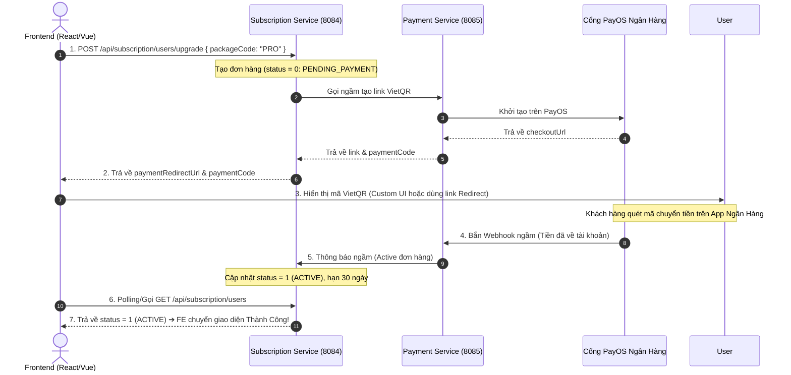

# 💳 HƯỚNG DẪN TÍCH HỢP THANH TOÁN VÀ NÂNG CẤP GÓI CƯỚC (PAYMENT & SUBSCRIPTION API)

Tài liệu này dành cho Lập trình viên Frontend (FE) để nắm bắt chuẩn xác các Endpoint API, cấu trúc dữ liệu và **cách tự Custom 100% Giao diện Thanh toán VietQR trên Frontend của riêng mình**.

---

## 🎨 1. HƯỚNG DẪN CUSTOM 100% GIAO DIỆN THANH TOÁN TRÊN FRONTEND (CUSTOM UI CHECKOUT)

Lập trình viên Frontend có **2 lựa chọn** để hiển thị màn hình thanh toán cho khách hàng:

### 🔹 Lựa chọn A: Dùng link có sẵn của PayOS (`paymentRedirectUrl`)
* **Cách làm**: Lấy trường `paymentRedirectUrl` từ API Upgrade trả về để mở trang web của PayOS trong cửa sổ mới (`window.open`) hoặc nhúng qua `<iframe src={paymentRedirectUrl} />`.

### 🔹 Lựa chọn B: TỰ DỰNG GIAO DIỆN CHECKOUT 100% TRÊN FRONTEND (Khuyên dùng)
Khi gọi API Upgrade, FE sẽ nhận được mã **`paymentCode`**. FE dùng mã này gọi sang `GET /api/payment/{paymentCode}` để lấy toàn bộ thông số chuyển khoản nguyên bản và tự vẽ giao diện.

Các trường dữ liệu FE trích xuất được:
* **`accountName`**: Tên chủ tài khoản (Ví dụ: `"CHU NGOC THANG"`)
* **`accountNumber`**: Số tài khoản ngân hàng (Ví dụ: `"VQRQAKAOF8466"`)
* **`amount`**: Số tiền cần thanh toán
* **`description`**: Nội dung chuyển khoản chính xác
* **`qrCode`**: Chuỗi dữ liệu chuẩn VietQR (Dùng thư viện `qrcode.react` để tự vẽ mã QR trên giao diện)

#### 💻 Mẫu Code React minh họa tự vẽ QR & Custom Giao diện:
```jsx
import QRCode from 'qrcode.react';

function CustomCheckoutModal({ paymentData }) {
  return (
    <div className="my-custom-checkout-card">
      <h2>Thanh toán gói PRO</h2>
      
      {/* Tự vẽ mã VietQR bằng chuỗi qrCode */}
      <div className="qr-container">
        <QRCode value={paymentData.qrCode} size={256} />
      </div>

      <div className="bank-details">
        <p><strong>Ngân hàng:</strong> {paymentData.bin}</p>
        <p><strong>Chủ tài khoản:</strong> {paymentData.accountName}</p>
        <p><strong>Số tài khoản:</strong> {paymentData.accountNumber}</p>
        <p><strong>Số tiền:</strong> {paymentData.amount.toLocaleString()} VNĐ</p>
        <p><strong>Nội dung chuyển khoản:</strong> <code>{paymentData.description}</code></p>
      </div>
    </div>
  );
}
```

---

## 🔄 2. SƠ ĐỒ LUỒNG HOẠT ĐỘNG (SYSTEM FLOW)



---

## 🌐 3. DANH SÁCH API CHUẨN XÁC DÀNH CHO FRONTEND

Tất cả các API dưới đây có thể gọi trực tiếp hoặc thông qua **API Gateway (`http://localhost:8080`)**.

### 🔹 API 1: Nâng cấp gói cước & Lấy Mã Thanh Toán (`paymentCode`)
API này được gọi khi người dùng bấm vào nút "Mua ngay" hoặc "Nâng cấp" gói PRO / ULTRA trên giao diện.

* **URL Direct**: `POST http://localhost:8084/api/subscription/users/upgrade`
* **URL Gateway**: `POST http://localhost:8080/api/subscription/users/upgrade`
* **Headers**: `Authorization: Bearer <JWT_TOKEN>`
* **Request Body (JSON)**:
  ```json
  {
    "packageCode": "PRO" 
  }
  ```
  *(Các mã gói hợp lệ: `"PRO"`, `"ULTRA"`, `"FREE"`)*

* **Response (JSON)**:
  ```json
  {
    "code": 200,
    "message": "Upgrade request registered successfully",
    "data": {
      "subscriptionId": "c39a812e-...",
      "paymentCode": 1719478192123456,
      "status": 0,
      "paymentRedirectUrl": "https://pay.payos.vn/web/657dd74e1ff74e63993b3b58b9dce737"
    }
  }
  ```
  👉 **Lưu ý**: Lấy mã `paymentCode` (`1719478192123456`) dùng cho API 2 nếu muốn Custom UI hoặc dùng cho API Hủy.

---

### 🔹 API 2: Lấy thông tin chi tiết Link thanh toán (Dùng để Custom UI)
API này cho phép FE lấy toàn bộ dữ liệu giao dịch nguyên bản từ PayOS để tự vẽ giao diện.

* **URL Direct**: `GET http://localhost:8085/api/payment/{paymentCode}`
* **URL Gateway**: `GET http://localhost:8080/api/payment/{paymentCode}`
* **Headers**: `Authorization: Bearer <JWT_TOKEN>`

* **Response (JSON)**:
  ```json
  {
    "code": 200,
    "message": null,
    "data": {
      "id": "pl_123456...",
      "orderCode": 1719478192123456,
      "amount": 10000,
      "amountPaid": 0,
      "amountRemaining": 10000,
      "status": "PENDING",
      "createdAt": "2026-06-27T17:00:00Z"
    }
  }
  ```

---

### 🔹 API 3: Kiểm tra trạng thái tài khoản & gói cước hiện tại
API này dùng để FE tải thông tin Dashboard hoặc thực hiện **Polling (gọi lặp lại 3s/lần)** sau khi người dùng mở khung thanh toán để kiểm tra xem tiền đã vào chưa.

* **URL Direct**: `GET http://localhost:8084/api/subscription/users`
* **URL Gateway**: `GET http://localhost:8080/api/subscription/users`
* **Headers**: `Authorization: Bearer <JWT_TOKEN>`

* **Response (JSON)**:
  ```json
  {
    "code": 200,
    "message": null,
    "data": {
      "id": "c39a812e-...",
      "userId": "d748f21a-...",
      "packageCode": "PRO",
      "packageName": "Gói Chuyên Nghiệp",
      "startDate": "2026-06-27T17:00:00",
      "expireDate": "2026-07-27T17:00:00",
      "status": 1
    }
  }
  ```

---

### 🔹 API 4: Xem danh sách gói cước khả dụng
Dùng để FE vẽ trang Bảng giá (Pricing Page).

* **URL Direct**: `GET http://localhost:8084/api/subscription/packages`
* **URL Gateway**: `GET http://localhost:8080/api/subscription/packages`
* **Headers**: Không yêu cầu

---

### 🔹 API 5: Hủy Link Thanh Toán (Khi người dùng bấm "Hủy bỏ")
Nếu người dùng mở khung thanh toán nhưng đổi ý bấm nút "Hủy thanh toán".

* **URL Direct**: `POST http://localhost:8085/api/payment/cancel`
* **URL Gateway**: `POST http://localhost:8080/api/payment/cancel`
* **Headers**: `Authorization: Bearer <JWT_TOKEN>`
* **Request Body (JSON)**:
  ```json
  {
    "paymentCode": 1719478192123456,
    "reason": "Nguoi dung bam huy tren giao dien"
  }
  ```

---

## 📊 4. BẢNG MÃ TRẠNG THÁI (SUBSCRIPTION STATUS ENUM)

| Mã Status | Tên Trạng Thái | Ý Nghĩa Mô Tả | Hành Động Trên FE |
| :---: | :--- | :--- | :--- |
| **`0`** | `PENDING_PAYMENT` | Đang chờ khách hàng chuyển khoản | Hiển thị mã QR & chờ đợi |
| **`1`** | `ACTIVE` | Gói cước đang hoạt động (Đã trả tiền) | Cho phép sử dụng full tính năng |
| **`2`** | `EXPIRED` | Gói cước đã hết hạn 30 ngày | Hiển thị thông báo yêu cầu gia hạn |
| **`3`** | `CANCELED` | Khách hàng đã hủy gói cước | Duy trì đến hết expireDate |
