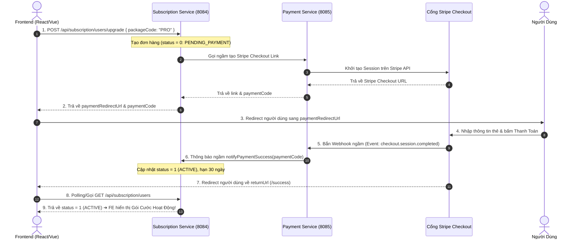

# 💳 HƯỚNG DẪN TÍCH HỢP THANH TOÁN STIPE VÀ NÂNG CẤP GÓI CƯỚC (STRIPE & SUBSCRIPTION API)

Tài liệu này hướng dẫn chi tiết cách tích hợp thanh toán cổng **Stripe (Stripe Checkout)** thay thế cho PayOS để nâng cấp gói cước tài khoản (`PRO`, `ULTRA`).

---

## 🎨 1. QUY TRÌNH THANH TOÁN VỚI STRIPE CHECKOUT

Khi người dùng chọn nâng cấp gói cước trên Frontend:
1. FE gọi API `POST /api/subscription/users/upgrade` kèm gói mong muốn (`PRO` hoặc `ULTRA`).
2. Backend trả về **`paymentRedirectUrl`** (Link dẫn đến cổng thanh toán bảo mật chuẩn quốc tế của Stripe Checkout).
3. FE chuyển hướng người dùng (`window.location.href = paymentRedirectUrl`) hoặc mở trong cửa sổ mới.
4. Người dùng nhập thẻ quốc tế (Visa, Mastercard...) hoặc Apple Pay / Google Pay trên trang Stripe.
5. Sau khi thanh toán thành công, Stripe tự động gửi **Webhook** về Backend `payment-service` để kích hoạt gói cước (`status = 1: ACTIVE`), đồng thời redirect người dùng về trang thành công (`returnUrl`).

---

## 🔄 2. SƠ ĐỒ LUỒNG HOẠT ĐỘNG (STRIPE SYSTEM FLOW)



---

## 🌐 3. DANH SÁCH API CHUẨN XÁC DÀNH CHO FRONTEND

### 🔹 API 1: Nâng cấp gói cước & Lấy Link Thanh Toán Stripe
API này được gọi khi người dùng bấm vào nút "Mua ngay" hoặc "Nâng cấp" gói PRO / ULTRA trên giao diện.

* **URL Direct**: `POST http://localhost:8084/api/subscription/users/upgrade`
* **URL Gateway**: `POST http://localhost:8080/api/subscription/users/upgrade`
* **Headers**: `Authorization: Bearer <JWT_TOKEN>`
* **Request Body (JSON)**:
  ```json
  {
    "packageCode": "PRO" 
  }
  ```

* **Response (JSON)**:
  ```json
  {
    "code": 200,
    "message": "Upgrade request registered successfully",
    "data": {
      "subscriptionId": "c39a812e-...",
      "paymentCode": 1719478192123456,
      "status": 0,
      "paymentRedirectUrl": "https://checkout.stripe.com/c/pay/cs_test_a1b2c3d4..."
    }
  }
  ```
  👉 **Hành động trên FE**: Lấy `paymentRedirectUrl` và cho trình duyệt chuyển hướng:
  ```javascript
  window.location.href = response.data.paymentRedirectUrl;
  ```

---

### 🔹 API 2: Kiểm tra trạng thái tài khoản & gói cước hiện tại
API này dùng để FE tải thông tin Dashboard hoặc thực hiện **Polling (gọi lặp lại 3s/lần)** tại trang `/success` sau khi Stripe redirect về để xác nhận tiền đã ghi nhận vào hệ thống.

* **URL Direct**: `GET http://localhost:8084/api/subscription/users`
* **URL Gateway**: `GET http://localhost:8080/api/subscription/users`
* **Headers**: `Authorization: Bearer <JWT_TOKEN>`

* **Response (JSON)**:
  ```json
  {
    "code": 200,
    "message": null,
    "data": {
      "id": "c39a812e-...",
      "userId": "d748f21a-...",
      "packageCode": "PRO",
      "packageName": "Gói Chuyên Nghiệp",
      "startDate": "2026-06-28T12:00:00",
      "expireDate": "2026-07-28T12:00:00",
      "status": 1
    }
  }
  ```

---

## 📊 4. BẢNG MÃ TRẠNG THÁI (SUBSCRIPTION STATUS ENUM)

| Mã Status | Tên Trạng Thái | Ý Nghĩa Mô Tả | Hành Động Trên FE |
| :---: | :--- | :--- | :--- |
| **`0`** | `PENDING_PAYMENT` | Đang chờ khách hàng thanh toán | Hiển thị nút thanh toán hoặc chờ đợi |
| **`1`** | `ACTIVE` | Gói cước đang hoạt động (Đã trả tiền) | Cho phép sử dụng full tính năng |
| **`2`** | `EXPIRED` | Gói cước đã hết hạn 30 ngày | Hiển thị thông báo yêu cầu gia hạn |
| **`3`** | `CANCELED` | Khách hàng đã hủy gói cước | Duy trì đến hết expireDate |
