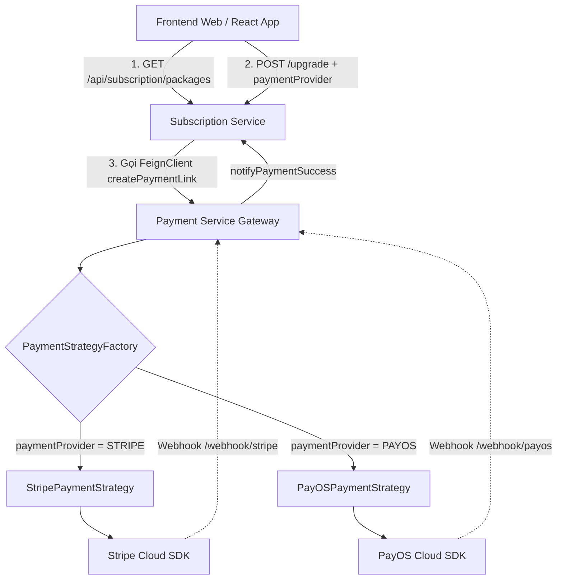

# 💳 TÀI LIỆU KỸ THUẬT & TÍCH HỢP TỔNG HỢP V2 (PAYOS & STRIPE)

Tài liệu này tổng hợp **toàn bộ nâng cấp kiến trúc mới nhất** cho hệ thống thanh toán của ứng dụng **AI Slide Generator**, bao gồm:
* Áp dụng **Strategy Pattern** hỗ trợ đa cổng thanh toán song song (**PayOS** & **Stripe**).
* Chuẩn hóa cơ chế lưu giá đa tiền tệ (**VNĐ** & **USD**) dưới Database và loại bỏ các thuộc tính dư thừa.
* Phân tách Webhook Endpoints riêng biệt cho từng nhà cung cấp.
* Hướng dẫn chi tiết tích hợp API dành cho Frontend và cấu hình môi trường Docker / Local.

---

## 🚀 1. TỔNG QUAN KIẾN TRÚC HỆ THỐNG (HIGH-LEVEL ARCHITECTURE)



### 🔑 Các điểm cải tiến cốt lõi:
1. **Strategy Pattern tại `payment-service`**:
   * **`PaymentStrategy` (Interface)**: Định nghĩa các tập lệnh tiêu chuẩn (`createPaymentLink`, `verifyWebhook`, `getPaymentLinkInformation`, `cancelPaymentLink`).
   * **`StripePaymentStrategy`**: Xử lý phiên thanh toán thẻ quốc tế (Stripe Checkout) & verify webhook chữ ký Stripe (`Stripe-Signature`).
   * **`PayOSPaymentStrategy`**: Xử lý phiên thanh toán chuyển khoản ngân hàng / quét mã VietQR & verify webhook PayOS (`x-payos-signature`).
   * **`PaymentStrategyFactory`**: Tự động nhận diện và khởi tạo đúng Strategy dựa theo tham số `paymentProvider`.
2. **Quản lý Đa Tiền Tệ Tròn Đẹp**:
   * Mỗi gói cước lưu song song 2 mệnh giá chuẩn dưới DB: `price_vnd` (cho khách Việt Nam qua PayOS) và `price_usd` (cho khách Quốc tế qua Stripe).
   * Thuộc tính `price` cũ đã được loại bỏ hoàn toàn để tránh dư thừa và xung đột dữ liệu.

---

## 📋 2. CẤU TRÚC GÓI CƯỚC DƯỚI DATABASE (`subscription_packages`)

Bảng dữ liệu gói cước đã được chuẩn hóa hỗ trợ cả 2 thị trường và đa chu kỳ thanh toán (`billing_cycle`):

| Mã Gói (`code`) | Tên Gói (`name`) | Chu Kỳ (`billing_cycle`) | Giá VNĐ (`price_vnd`) | Giá USD (`price_usd`) |
| :--- | :--- | :--- | :--- | :--- |
| **`FREE`** | Gói Miễn Phí | `0` (Hằng tháng) | **0 VNĐ** | **$0 USD** |
| **`PRO`** | Gói Chuyên Nghiệp | `0` (Hằng tháng) | **199.000 VNĐ** | **$10 USD** |
| **`PRO`** | Gói Chuyên Nghiệp | `1` (Hằng năm) | **1.990.000 VNĐ** | **$100 USD** |
| **`ULTRA`** | Gói Vô Cực | `0` (Hằng tháng) | **499.000 VNĐ** | **$20 USD** |

---

## 🌐 3. HƯỚNG DẪN TÍCH HỢP CHO FRONTEND (API SPECIFICATIONS)

### 🔹 API 1: Lấy danh sách gói cước niêm yết
* **Endpoint Gateway**: `GET http://localhost:8080/api/subscription/packages`
* **Response Ví dụ**:
  ```json
  {
    "code": 1000,
    "message": "Success",
    "data": [
      {
        "id": "c6a21e42-...",
        "code": "PRO",
        "name": "Gói Chuyên Nghiệp",
        "description": "Tính năng nâng cao (20 slide/ngày, ảnh HD, Xuất PDF)",
        "priceVnd": 199000,
        "priceUsd": 10,
        "billingCycle": 0,
        "features": [...]
      }
    ]
  }
  ```

---

### 🔹 API 2: Khởi tạo đơn hàng Nâng cấp gói cước
* **Endpoint Gateway**: `POST http://localhost:8080/api/subscription/users/upgrade`
* **Headers**: `Authorization: Bearer <JWT_TOKEN>`
* **Request Body (Thanh toán Thẻ Quốc tế qua Stripe)**:
  ```json
  {
    "packageCode": "PRO",
    "billingCycle": 0,
    "paymentProvider": "STRIPE"
  }
  ```
* **Request Body (Thanh toán Quét mã VietQR qua PayOS)**:
  ```json
  {
    "packageCode": "PRO",
    "billingCycle": 0,
    "paymentProvider": "PAYOS"
  }
  ```
* **Response Trả về**:
  ```json
  {
    "code": 1000,
    "message": "Upgrade request registered successfully",
    "data": {
      "subscriptionId": "8b4a71ab-...",
      "paymentCode": 2629708601654507,
      "status": 0,
      "paymentRedirectUrl": "https://checkout.stripe.com/c/pay/cs_test_...",
      "clientSecret": "cs_test_..._secret_..."
    }
  }
  ```
👉 **Lưu ý cho Frontend**:
* Bạn có thể nhảy thẳng trang bằng `window.location.href = data.paymentRedirectUrl`.
* Hoặc nếu làm giao diện nhúng Modal bằng Stripe Elements, bạn dùng `data.clientSecret`.

---

## ⚙️ 4. CẤU HÌNH MÔI TRƯỜNG & DOCKER (ENV CONFIGURATION)

### 📄 1. File `application.yml` (`payment-service`)
```yaml
payos:
  client-id: ${PAYOS_CLIENT_ID:mock_client_id}
  api-key: ${PAYOS_API_KEY:mock_api_key}
  checksum-key: ${PAYOS_CHECKSUM_KEY:mock_checksum_key}

stripe:
  secret-key: ${STRIPE_SECRET_KEY:sk_test_mock_secret_key}
  webhook-secret: ${STRIPE_WEBHOOK_SECRET:whsec_mock_webhook_secret}
  currency: ${STRIPE_CURRENCY:usd}
```

### 📄 2. File `.env` (Đặt ở thư mục gốc dự án & thư mục `payment-service`)
```env
# PayOS Configuration
PAYOS_CLIENT_ID=your_payos_client_id
PAYOS_API_KEY=your_payos_api_key
PAYOS_CHECKSUM_KEY=your_payos_checksum_key

# Stripe Configuration
STRIPE_SECRET_KEY=stripe_secret_key
STRIPE_WEBHOOK_SECRET=stripe_webhook_secret
STRIPE_CURRENCY=usd
```

### 📄 3. File `docker-compose.yml`
```yaml
  payment-service:
    build:
      context: ./back-end/payment-service
    container_name: ai-payment-service
    restart: unless-stopped
    ports:
      - "${PAYMENT_SERVICE_PORT:-8085}:8085"
    env_file:
      - .env
    environment:
      PORT: 8085
      PAYOS_CLIENT_ID: ${PAYOS_CLIENT_ID}
      PAYOS_API_KEY: ${PAYOS_API_KEY}
      PAYOS_CHECKSUM_KEY: ${PAYOS_CHECKSUM_KEY}
      STRIPE_SECRET_KEY: ${STRIPE_SECRET_KEY}
      STRIPE_WEBHOOK_SECRET: ${STRIPE_WEBHOOK_SECRET}
      STRIPE_CURRENCY: ${STRIPE_CURRENCY:-usd}
      JWT_SIGNER_KEY: ${JWT_SIGNER_KEY}
      SUBSCRIPTION_SERVICE_URL: http://subscription-service:8084/api/subscription
```

---

## 🛡️ 5. ĐĂNG KÝ WEBHOOK ENDPOINTS 

Để hệ thống tự động kích hoạt gói cước cho người dùng sau khi thanh toán thành công:

1. **Stripe Webhook**:
   * **Local Development (CLI)**:
     ```bash
     stripe listen --forward-to localhost:8085/api/payment/webhook/stripe
     ```
   * **Production**: Đăng ký Endpoint `https://yourdomain.com/api/payment/webhook/stripe` trên Dashboard Stripe.
2. **PayOS Webhook**:
   * **Local Development (Tunnel)**: Chạy công cụ tạo tunnel như `ngrok` hoặc `pinggy` để lấy URL công khai, sau đó cấu hình:
     `https://<your-subdomain>.ngrok-free.app/api/payment/webhook/payos` trên Dashboard PayOS.
   * **Production**: Đăng ký Endpoint `https://yourdomain.com/api/payment/webhook/payos` trên Dashboard [payos.vn](https://payos.vn).

---

## 🧪 6. HƯỚNG DẪN KIỂM THỬ HỆ THỐNG (TESTING GUIDE)

### 🅰️ Kiểm Thử Cổng STRIPE

#### 1. Tạo Phiên Thanh Toán (Checkout Session)
* Gửi request `POST /api/subscription/users/upgrade` với `"paymentProvider": "STRIPE"`.
* Lấy link `paymentRedirectUrl` dán vào trình duyệt để thanh toán thử với thẻ test của Stripe.

#### 2. Giả Lập Webhook Bằng Stripe CLI (Bypass Local)
* Bật lắng nghe webhook tại máy local:
  ```bash
  stripe listen --forward-to localhost:8085/api/payment/webhook/stripe
  ```
  *(Lấy mã `whsec_...` hiển thị trên màn hình điền vào biến `STRIPE_WEBHOOK_SECRET` trong file `.env`)*
* Để giả lập sự kiện thanh toán thành công cho đúng đơn hàng đang test, chạy lệnh:
  ```bash
  stripe trigger checkout.session.completed --override checkout_session:client_reference_id=<MÃ_ĐƠN_HÀNG_MẪU>
  ```
  *(Thay thế `<MÃ_ĐƠN_HÀNG_MẪU>` bằng giá trị `paymentCode` nhận được ở API Upgrade)*

---

### 🅱️ Kiểm Thử Cổng PAYOS

#### 1. Chạy Tunnel Để Test Luồng Thật Từ PayOS Sandbox
* **Cách 1: Sử dụng Ngrok (Khuyên dùng)**:
  ```bash
  ngrok http 8085
  ```
  *(Lấy link `https://xxxx.ngrok-free.app` cấu hình vào ô Webhook URL trên PayOS Dashboard).*
* **Cách 2: Sử dụng SSH có sẵn trên Windows (Không cần cài đặt)**:
  ```bash
  ssh -R 80:localhost:8085 a.pinggy.io
  ```
  *(Lấy link `https://xxxx.pinggy.link` cấu hình vào ô Webhook URL trên PayOS Dashboard).*

#### 2. Giả Lập Webhook Bằng Postman (Không Cần Deploy/Cài Phần Mềm)
Khi không có kết nối internet hoặc muốn test nhanh logic Backend kích hoạt gói cước mà không cần quét mã QR:

* **Endpoint**: `POST http://localhost:8085/api/payment/webhook/payos`
* **Headers**: `Content-Type: application/json`
* **Body (Raw JSON)**:
  ```json
  {
    "success": true,
    "data": {
      "orderCode": 2830567837111045,
      "amount": 199000,
      "description": "Nang cap goi PRO",
      "reference": "FT24012345678",
      "code": "00",
      "desc": "SUCCESS"
    }
  }
  ```

> [!IMPORTANT]
> **Chú Ý Đặc Biệt Khi Test Giả Lập Bằng Postman**:
> Bạn cần thay đổi giá trị `"orderCode": 2830567837111045` trong JSON trên thành **mã `paymentCode` thực tế** đang ở trạng thái `PENDING` trong bảng `user_subscriptions` dưới Database của bạn. Nếu truyền sai mã đơn hàng hoặc truyền mã đơn hàng không tồn tại (ví dụ: `123`), hệ thống sẽ trả về lỗi `404 - User subscription not found`.

