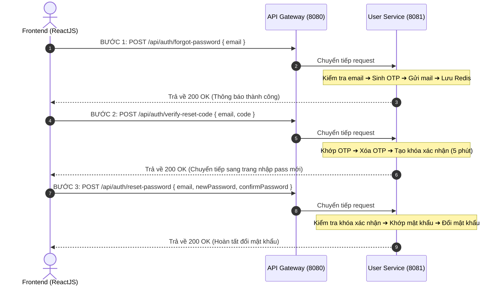

# Hướng Dẫn Tích Hợp API Quên Mật Khẩu (Forgot Password Flow)
*Tài liệu dành riêng cho lập trình viên Frontend (ReactJS)*

Hệ thống sử dụng luồng **3 bước bảo mật** để thực hiện tính năng Quên và Đặt lại mật khẩu của người dùng nhằm mang lại trải nghiệm UX tốt nhất và tăng tính an toàn.

---

## 🗺️ Luồng Tích Hợp (Sequence Diagram)



---

## 🛠️ Chi Tiết Danh Sách API

### Bước 1: Yêu cầu gửi mã OTP về Email
Dùng khi người dùng nhập email vào form quên mật khẩu và nhấn "Gửi mã".

*   **URL**: `POST /api/auth/forgot-password` (hoặc trực tiếp qua `http://localhost:8081/auth/forgot-password` khi test local)
*   **Xác thực JWT**: Không yêu cầu (Public)
*   **Body (JSON)**:
    ```json
    {
      "email": "dungnguyen@gmail.com"
    }
    ```
*   **Response (Thành công - HTTP 200)**:
    ```json
    {
      "code": 1000,
      "data": "Mã xác thực đặt lại mật khẩu đã được gửi tới email của bạn."
    }
    ```
*   **Response (Lỗi Email không tồn tại - HTTP 404)**:
    ```json
    {
      "code": 1505,
      "message": "User not existed"
    }
    ```

---

### Bước 2: Xác thực mã OTP người dùng nhập
Dùng khi người dùng nhận được mã OTP (6 số) gửi qua email, nhập vào form và nhấn "Xác nhận".

*   **URL**: `POST /api/auth/verify-reset-code` (hoặc trực tiếp qua `http://localhost:8081/auth/verify-reset-code`)
*   **Xác thực JWT**: Không yêu cầu (Public)
*   **Body (JSON)**:
    ```json
    {
      "email": "dungnguyen@gmail.com",
      "code": "123456"
    }
    ```
*   **Response (Thành công - HTTP 200)**:
    ```json
    {
      "code": 1000,
      "data": "Xác thực OTP thành công! Vui lòng nhập mật khẩu mới để thiết lập."
    }
    ```
    *(Sau khi nhận API này thành công, Frontend cho phép người dùng chuyển tiếp sang màn hình/form đặt lại mật khẩu mới).*
*   **Response (Lỗi OTP sai hoặc hết hạn 15 phút - HTTP 400)**:
    ```json
    {
      "code": 1512,
      "message": "Invalid code or expired"
    }
    ```

---

### Bước 3: Đặt lại mật khẩu mới
Dùng khi người dùng điền Mật khẩu mới và Mật khẩu xác nhận để hoàn tất quy trình.

*   **URL**: `POST /api/auth/reset-password` (hoặc trực tiếp qua `http://localhost:8081/auth/reset-password`)
*   **Xác thực JWT**: Không yêu cầu (Public)
*   **Body (JSON)**:
    > [!IMPORTANT]
    > Chú ý viết đúng kiểu camelCase (`newPassword`, `confirmPassword`). Nếu viết thành snake_case (`new_password`), API sẽ bị lỗi Validate.
    ```json
    {
      "email": "dungnguyen@gmail.com",
      "newPassword": "newPassword123",
      "confirmPassword": "newPassword123"
    }
    ```
*   **Response (Thành công - HTTP 200)**:
    ```json
    {
      "code": 1000,
      "data": "Đặt lại mật khẩu thành công! Bạn có thể dùng mật khẩu mới để đăng nhập."
    }
    ```
*   **Response (Lỗi Mật khẩu xác nhận không khớp - HTTP 400)**:
    ```json
    {
      "code": 1513,
      "message": "Mật khẩu xác nhận không trùng khớp"
    }
    ```
*   **Response (Lỗi Phiên xác nhận quá 5 phút hoặc chưa qua Bước 2 - HTTP 400)**:
    ```json
    {
      "code": 1514,
      "message": "Phiên đặt lại mật khẩu chưa được xác thực hoặc đã hết hạn"
    }
    ```

---

## 💡 Ví dụ code gọi API (Axios / Fetch) trong ReactJS

```javascript
import axios from 'axios';

const API_BASE_URL = 'http://35.239.29.193:8080/api/auth'; // Hoặc lấy từ biến config của FE

// Bước 1: Yêu cầu cấp OTP
async function handleForgotPassword(email) {
  try {
    const response = await axios.post(`${API_BASE_URL}/forgot-password`, { email });
    alert(response.data.data); // Hiển thị thông báo gửi OTP thành công
    // FE: Chuyển hướng sang giao diện nhập OTP
  } catch (error) {
    alert(error.response?.data?.message || 'Có lỗi xảy ra');
  }
}

// Bước 2: Xác thực mã OTP
async function handleVerifyOTP(email, code) {
  try {
    const response = await axios.post(`${API_BASE_URL}/verify-reset-code`, { email, code });
    alert(response.data.data); // Xác thực OTP thành công
    // FE: Chuyển hướng sang giao diện nhập mật khẩu mới
  } catch (error) {
    alert(error.response?.data?.message || 'Mã xác thực không hợp lệ');
  }
}

// Bước 3: Đặt lại mật khẩu mới
async function handleResetPassword(email, newPassword, confirmPassword) {
  try {
    const response = await axios.post(`${API_BASE_URL}/reset-password`, {
      email,
      newPassword,
      confirmPassword
    });
    alert(response.data.data); // Đổi mật khẩu thành công
    // FE: Quay lại trang Đăng nhập
  } catch (error) {
    alert(error.response?.data?.message || 'Lỗi đặt lại mật khẩu');
  }
}
```
